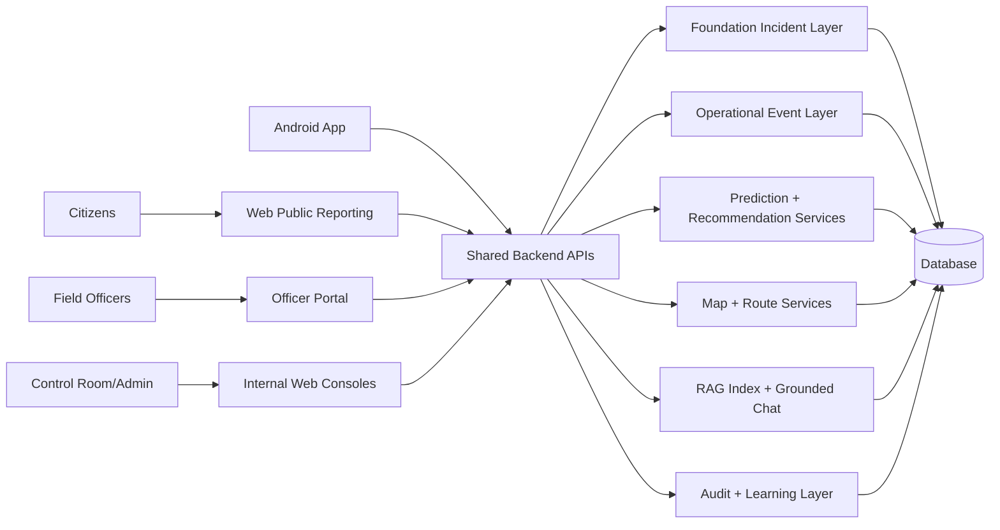
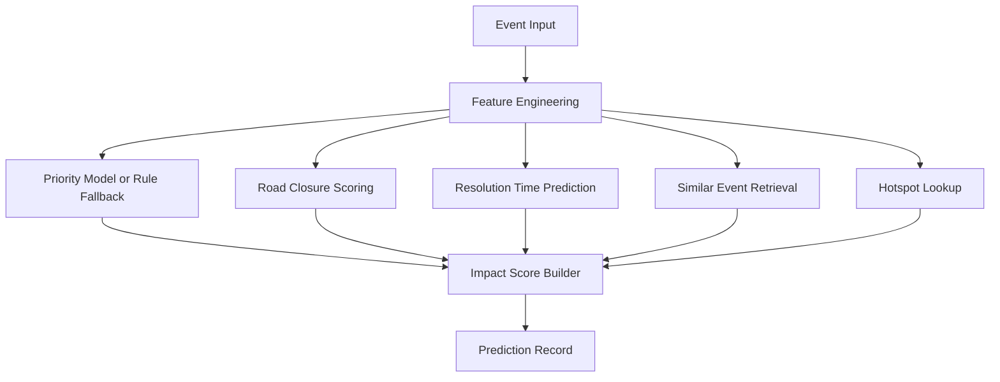
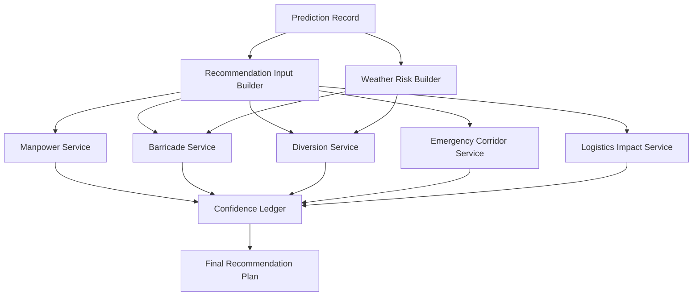
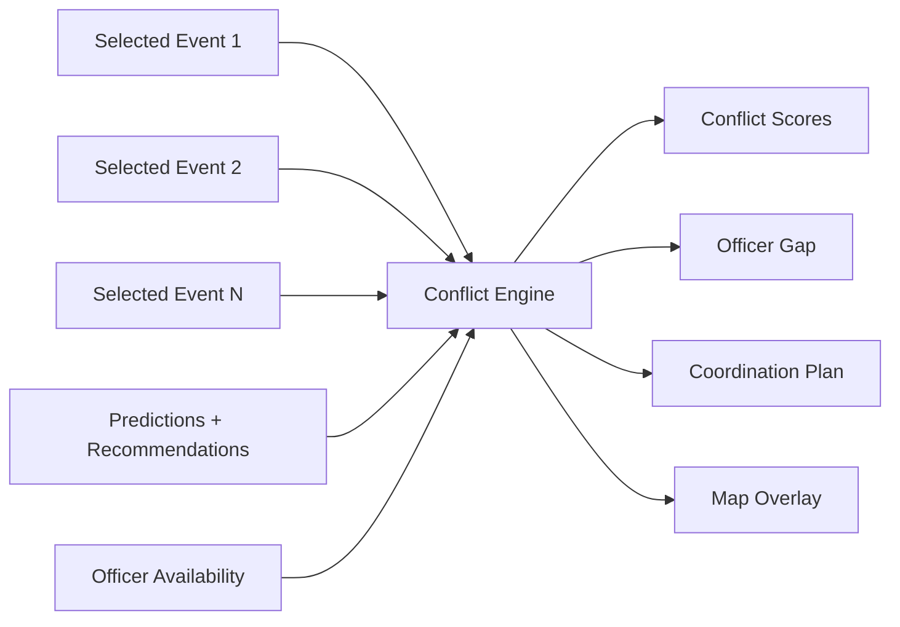
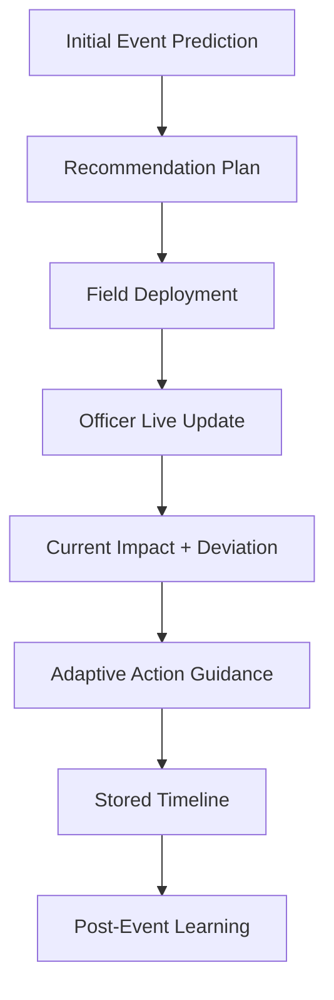
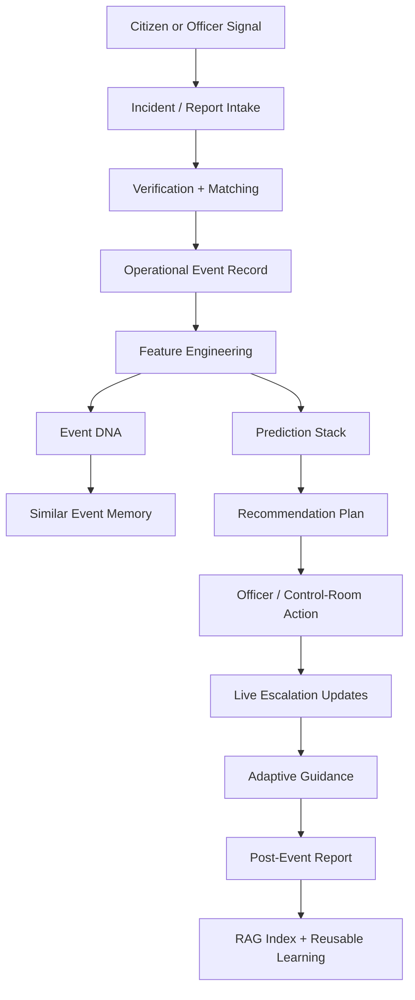

# Sanchar Sarthi Feature Book

## What This Product Is

Sanchar Sarthi is a traffic operations platform built around one core idea:

**take noisy traffic signals from the ground, turn them into structured operational intelligence, and help command teams respond faster.**

The codebase is not a single dashboard. It is a connected system with:

- a public-facing reporting layer
- protected control-room and admin workflows
- an officer workspace
- an event simulation and planning engine
- map intelligence and hotspot analysis
- a grounded RAG assistant
- a post-event learning loop
- a companion Android app

The implemented product is designed for three real operating needs:

1. **See** what is happening right now.
2. **Plan** what should be done next.
3. **Learn** from what actually happened.

That full loop is already present in the current codebase.

---

## One-Line Judge Summary

Sanchar Sarthi is a multi-surface traffic command system that combines public reports, officer updates, event prediction, operational planning, hotspot intelligence, grounded retrieval, audit logging, and post-event learning in one stack.

---

## What Is Implemented Right Now

The product currently includes all of the following implemented modules:

### Web surfaces

- Public landing and report workflow
- User-mode incident feed
- Control-room command surface
- Admin operations console
- Officer portal
- Event dossier view
- Simulation lab
- Map intelligence console
- Explorer view for hotspot/event lookup
- Model insights page
- Post-event learning page
- Demo readiness / deterministic seed page
- Login and protected session flows

### Backend capabilities

- Firebase-token-backed role enforcement
- Incident intake and voting
- Event storage and event feature generation
- Event DNA generation
- Similar-event retrieval
- Priority prediction
- Road-closure scoring
- Resolution-time prediction
- Impact scoring
- Weather adjustment logic
- Recommendation orchestration
- Live escalation tracking
- Multi-event conflict analysis
- Post-event report generation
- Translation normalization
- RAG indexing and grounded chat
- Audit logging
- Demo seeding and rebuild scripts

### Mobile app

- Android Jetpack Compose client
- Firebase sign-in
- Role-based navigation
- Citizen reporting
- Officer workspace
- Simulation screen
- Map intelligence screen
- Explorer screen
- Model insights screen
- Admin and control-room screens
- Built-in language switching with on-device translation
- Network awareness and offline fallback screen

---

## Product Surfaces At A Glance

| Surface | Main user | Purpose |
|---|---|---|
| Public report flow | Citizen | Submit traffic issues and contribute signal quality |
| Foundation incident feed | Citizen / public user | Browse active and reported incidents |
| Control room | Internal ops | Verify, activate, reject, and resolve incidents |
| Admin console | Admin | User management, officer creation, system controls, RAG indexing, incident escalation |
| Officer portal | Police officer | View assignments and submit field escalation updates |
| Simulation lab | Admin / control room / assigned officer | Create hypothetical events and generate operational plans |
| Event dossier | Internal users / assigned officers | See complete event intelligence for one event |
| Map intelligence | Internal users | Hotspots, geocode, route advisory, multi-event conflict analysis |
| Explorer | Internal users | Browse hotspots and open event dossiers fast |
| Model insights | Internal users | Health, model run visibility, model state |
| Post-event learning | Internal users | Generate after-action reports from stored event lifecycle data |
| Android app | Multi-role mobile usage | Mobile version of reporting, viewing, simulation, officer, map, and ops flows |

---

## Core Operating Philosophy

Sanchar Sarthi is not pretending to be a live city-wide traffic signal system.

The implemented code is intentionally honest about what it knows and what it does not know.

That shows up everywhere:

- recommendation panels call themselves **operational guidance**, not guarantees
- weather logic is marked as **manual override** or source-tagged when applicable
- the confidence ledger shows where evidence comes from
- road-closure probability is treated as a stronger signal than a binary yes/no helper
- missing live telemetry is explicitly surfaced rather than silently fabricated
- RAG answers are instructed to only use retrieved context

This honesty is one of the strongest characteristics of the codebase.

---

## High-Level System Architecture

---

## Actual Stack In The Repo

### Frontend

- Next.js App Router
- React
- TanStack Query
- Firebase Web Auth
- role/session store for backend-verified access

### Backend

- FastAPI
- SQLAlchemy ORM
- Alembic migrations
- Firebase Admin verification
- Pydantic request/response models

### Mobile

- Android
- Kotlin
- Jetpack Compose
- Retrofit
- Firebase Auth
- ML Kit translation

### Data and storage

- SQL-backed operational store
- event, recommendation, report, audit, hotspot, officer, user, and RAG chunk tables

### Intelligence layer

- feature engineering pipeline
- trained priority model
- trained road-closure model
- trained resolution-time model
- rule-plus-model orchestration
- grounded RAG retrieval and streaming answer service

---

## Backend Route Map

The backend is not monolithic in behavior even though it runs as one FastAPI app. It is organized by domain.

### Core route groups

- `/api/health`
- `/api/auth`
- `/api/foundation`
- `/api/reports`
- `/api/events`
- `/api/live-updates`
- `/api/map`
- `/api/officer`
- `/api/post-event`
- `/api/admin`
- `/api/analytics`
- `/api/translation`
- `/api/rag`
- `/api/demo`
- `/api/datasets`
- `/api/recommendations`

### Startup behavior

On backend startup, the app:

1. imports ORM model modules
2. initializes Firebase admin support
3. starts a background route-fetch loop
4. starts a periodic RAG live-update indexing loop when RAG is enabled

This means the app is not just request/response. It also keeps background system intelligence active.

---

## Access Model And Role Boundaries

The entire product is built around backend-enforced access, not just frontend role labels.

### Implemented roles in practice

- `citizen`
- `police_officer`
- `control_room`
- `admin`

There are also normalized aliases and canonical-role mappings inside the backend and app session logic.

### Important access rules

- Public users can browse public incidents.
- Citizens can submit public reports.
- Non-citizen report sources require Firebase auth.
- Officer-source reports require a police officer account.
- Control-room-source or demo-source reports require admin or control-room access.
- Simulation is protected and requires internal access.
- Event dossiers require internal access and officer assignment validation.
- Multi-event analysis also checks officer assignment to the involved events/corridors/stations/zones.
- Admin-only actions include user mutation, vote deletion, station control, RAG rebuild, and incident escalation.

### Why this matters

This is not cosmetic role UI. The backend is actively checking:

- Firebase identity
- backend user role
- assignment eligibility
- source-level authorization

That makes the product credible as an operational system rather than just a prototype with hidden buttons.

---

## Foundation Incident Layer

This is the lighter-weight incident response layer that powers public reporting and controlled verification.

### What it stores and manages

- incident type
- title
- description
- severity
- location name
- latitude / longitude
- locality / ward
- source type
- true/false vote counts
- confidence score
- assigned station
- police force estimate
- barricade estimate
- route impact summary
- resolution notes
- station alert flag
- status lifecycle

### Status lifecycle

The implemented incident lifecycle includes:

- `reported`
- `pending_verification`
- `active`
- `escalated`
- `resolved`
- `rejected`
- `archived`

### Public interaction features

- browse public-visible incidents
- vote true / false
- see assigned station and contact where available
- see route impact summary

### Internal interaction features

- approve
- reject
- activate
- resolve
- archive
- delete
- escalate incident into a full operational event

### Escalation bridge

One of the most important implemented transitions is:

**Foundation Incident -> Operational Event**

When admin escalates an incident, the system:

1. creates a new event ID
2. maps incident severity into event priority
3. converts incident type into cleaned event cause
4. builds event features
5. runs prediction
6. builds Event DNA
7. finds similar historical events
8. generates a recommendation plan
9. updates incident status to `escalated`
10. writes an audit log

That bridge is one of the strongest end-to-end flows in the codebase.

---

## Public Reporting Flow

The reporting layer is more than a plain form.

### It supports multiple report sources

- citizen
- field officer
- control room
- demo

### Public safety and abuse control

The code includes a rate limiter for public citizen reports:

- 10 reports
- per 60-second window
- keyed by source and client host

### Report processing behavior

When a report is submitted, the backend can:

- normalize / translate text
- create a structured citizen report record
- attempt event matching
- assign alert level
- calculate report confidence
- capture metadata like match method and nearby duplicate count
- write an audit log
- index the report into RAG
- reindex the matched event for updated context

### Why this matters

This means public input is not treated as noise. It is converted into structured operational signal that can later influence:

- event dossier context
- live monitoring
- post-event learning
- RAG evidence

---

## Event Layer

The event system is the heavier operational core of Sanchar Sarthi.

### Event records carry

- event ID
- event type
- raw and cleaned event cause
- priority
- status
- corridor
- police station
- zone
- junction
- closure requirement flag
- start and end datetime
- description language
- normalization method
- optional vehicle type

### Supported behavior

- direct event retrieval
- simulation event creation
- event feature generation
- Event DNA build/rebuild
- prediction generation
- recommendation generation
- similar-event retrieval
- live update linkage
- citizen report linkage
- map overlay linkage
- post-event report linkage

---

## Event Dossier

The event dossier is one of the richest screens in the product.

It acts like a single-screen intelligence sheet for one operational event.

### A dossier contains

- event snapshot
- engineered features
- Event DNA
- prediction output
- recommendation output
- similar historical matches
- linked citizen reports
- linked live updates
- hotspot overlay context

### Why this matters

This page is where Sanchar Sarthi stops looking like a collection of endpoints and starts looking like a real command product.

It fuses:

- raw event details
- derived intelligence
- planning output
- field signal
- history-backed evidence

into one operational view.

---

## Event DNA

Event DNA is the product’s structured “operational fingerprint” layer.

### It builds a compact explanation of an event through:

- `dna_summary`
- `time_context`
- `location_context`
- `cause_context`
- `weather_context`
- `multi_event_context`
- `historical_pattern`
- `risk_indicators_json`
- `similar_event_ids_json`

### What it is doing conceptually

Instead of storing only a category like “waterlogging”, Event DNA explains:

- when this kind of event tends to matter
- where it is happening in operational terms
- what risk signals support concern
- which older cases look similar

### Why it matters

This layer makes the product explainable.

It is the bridge between:

- raw event data
- model output
- human-readable planning language

---

## Feature Engineering Layer

Every prediction and recommendation starts with engineered event features.

### Implemented feature categories

- event hour / day / month / weekday
- weekend flag
- peak-hour flag
- night-event flag
- event duration
- closure duration
- resolution duration
- duration source
- location cluster ID
- historical corridor risk
- historical police-station risk
- historical cluster risk
- historical cause closure rate
- historical corridor closure rate
- historical police-station closure rate
- historical cluster closure rate

### Why this matters

The system is not making decisions from raw text alone.

It derives:

- temporal context
- local risk context
- closure history
- spatial grouping context

before planning begins.

---

## Similar Event Memory

The system finds similar past events and surfaces them in:

- simulation
- event dossiers
- Event DNA
- RAG context

### Similarity uses structured operational alignment

This is not a pure text-only memory feature in the current implementation.

It looks at operational similarity signals such as:

- corridor
- police station
- event type
- priority
- hotspot cluster
- operational fingerprint factors

### Why it matters

This gives the system a memory of “what looked like this before” and strengthens both explainability and confidence.

---

## Prediction Stack

The prediction system combines trained models and rule fallback.

### The three trained models

- **Priority model**
- **Road closure model**
- **Resolution time model**

### What the prediction layer returns

- predicted priority
- priority confidence
- road-closure probability
- predicted road-closure helper flag
- estimated clearance minutes
- clearance confidence
- clearance confidence note
- historical clearance range min/max
- estimated impact score
- impact category
- impact radius in km
- vehicle impact factor
- vehicle impact note
- baseline risk score
- additional event delta
- weather adjustment JSON
- multi-event conflict snapshot JSON
- explanation JSON
- model version

### Priority logic

The backend tries to use the trained priority model first.

If the model or dependencies are unavailable, it falls back to a rule-based urgency estimate.

That fallback considers things like:

- priority label
- closure requirement
- planned vs unplanned
- peak hour

### Road closure logic

Road closure is treated as a probability-first signal.

The binary closure output is clearly presented as an operational helper, not the main truth signal.

### Resolution-time logic

The product predicts expected clearance duration and also preserves confidence notes and historical ranges.

That gives more operational value than a single unexplained number.

---

## Prediction Flow Diagram

---

## Impact Assessment And Counterfactual

The product does not stop at “high” or “low”.

It also generates:

- impact score
- impact category
- estimated impact radius
- baseline risk score
- event-adjusted score
- additional event delta

### Why that is important

This gives the user two layers:

1. **what the current event likely causes**
2. **how much extra disruption this event adds over baseline conditions**

That is much more useful for ops than a plain severity badge.

---

## Weather Adjustment Layer

Weather is a first-class modifier in the current implementation.

### Supported weather concepts in code

- clear
- cloudy
- light rain
- rain
- heavy rain
- rain amount
- visibility in meters
- live weather toggle

### Output from weather adjustment includes

- weather condition
- weather factor
- rain mm
- visibility
- low visibility flag
- waterlogging risk
- reason codes
- source
- provider
- provider status
- explanatory note

### Important product behavior

Weather can reshape recommendations.

For example, it can influence:

- barricade level
- field notes
- diversion strategy
- upstream focus points

This is one of the reasons the same event can produce different plans under clear conditions and heavy rain.

---

## Recommendation Orchestrator

After prediction, the recommendation engine assembles an operational plan.

### Recommendation modules

- manpower
- barricades
- diversions
- emergency corridor
- logistics impact
- confidence ledger
- action summary

### Plan outputs include

- risk summary
- weather risk block
- manpower plan
- barricade plan
- diversion plan
- emergency corridor guidance
- logistics impact guidance
- action confidence ledger
- recommended action summary

### Judge takeaway

This is not a text blob generator.

It is a structured orchestration layer that turns event intelligence into multiple operational sub-plans.

---

## Recommendation Flow Diagram

---

## Confidence Ledger

One of the most distinctive parts of the system is the confidence ledger.

It explicitly tells the user what evidence class each planning block depends on.

### Implemented confidence inputs include

- ASTraM historical events
- priority and impact estimate
- road-closure likelihood
- weather modifier
- manpower and diversion heuristics
- live traffic speed

### Why this is strong

The product admits when something is:

- dataset-backed
- heuristic
- optional ML
- future/live integration not present yet

That makes the system feel responsible instead of over-claiming.

---

## Simulation Lab

The simulation page is the clearest demonstration surface in the product.

### Inputs supported

- event type
- event cause
- latitude
- longitude
- corridor
- police station
- zone
- junction
- start datetime
- expected duration
- expected crowd size
- available officers
- weather condition
- rain mm
- visibility
- live weather toggle
- description
- vehicle type

### Outputs shown

- Event DNA
- similar-event summary
- predicted priority
- closure probability
- estimated clearance
- impact score
- impact category
- impact radius
- counterfactual block
- weather risk block
- recommendation suite
- confidence ledger
- map overlays

### Why it matters

This is the best place to show that:

- the system reasons from structured inputs
- outputs change with conditions
- planning is derived, not manually typed

---

## Multi-Event Conflict Analysis

Sanchar Sarthi does not only plan for isolated events.

It also analyzes operational conflicts across multiple simultaneous events.

### Inputs

- event IDs
- available officers

### Pairwise conflict signals

- time overlap
- impact-radius overlap
- nearby-event radius
- shared corridor
- shared police station
- diversion route conflict
- manpower gap

### Output includes

- conflict detected yes/no
- combined risk
- coordination mode
- high-conflict count
- conflict signals
- total manpower demand
- available officers
- officer gap
- coordination plan
- pairwise conflict cards
- map overlay
- honesty note

### Why this is special

Most hackathon dashboards stop at single-event prediction.

This system also asks:

**what happens when two plans start competing for the same corridor, time window, or manpower pool?**

---

## Multi-Event Analysis Diagram

---

## Map Intelligence

The map layer is not only decorative.

### Implemented map functions

- provider config inspection
- route request generation
- active route retrieval from cache
- address geocoding
- hotspot overlay rendering
- multi-event map overlay

### Provider model

The current backend is configured around MapmyIndia / Mappls.

The map config endpoint exposes:

- active provider
- primary provider
- key availability
- credit budget
- budget-guard state
- default center
- default zoom
- provider note

### Route generation characteristics

- driving mode supported
- origin/destination validation inside Bengaluru demo area
- purpose tagging
- optional incident binding
- cached route reuse

### Geocode behavior

- protected internal access
- query input
- optional proximity input
- structured candidate list
- honesty note on result set

### Active routes

The backend can also expose currently cached active routes tied to active/escalated incidents.

---

## Hotspot Intelligence

Hotspot analysis is one of the strongest data-driven modules.

### What the hotspot system represents

Clusters of operationally related historical events are stored and surfaced through:

- location cluster ID
- centroid coordinates
- event count
- risk score
- cluster type
- radius
- top event cause
- peak-hour tendencies
- closure tendencies
- profile JSON

### Where hotspots appear

- map intelligence
- explorer
- event dossiers
- Event DNA
- RAG analytics context

### Why this matters

The hotspot layer makes the system spatially aware at the operational-history level even when it is not pretending to be a full live traffic twin.

---

## Officer Portal

The officer portal is a proper role-specific surface.

### What it does

- authenticates a registered officer
- loads the officer profile and assignments
- shows assigned events
- allows event selection
- submits live field updates

### Live update fields conceptually support

- congestion level
- free-text field update
- action signal flags like closure / shortage / crowd increase / rain-waterlogging

### Result of a live update

The backend stores a live event update that can later appear in:

- event dossier
- adaptive escalation timeline
- post-event report
- RAG context

### Why this matters

This turns the system from prediction-only into monitor-and-adapt.

---

## Live Escalation Loop

The product has a real feedback loop:

### What this means in practice

The system can compare:

- expected impact
- current impact
- deviation from forecast

and attach recommended actions when field conditions worsen.

---

## Post-Event Learning

This is the “close the loop” layer.

### The post-event report contains

- event summary
- predicted impact
- observed impact
- deviation
- report count considered
- prediction summary
- recommendation summary
- citizen report summary
- live escalation summary
- lessons learned
- future recommendations
- structured learning snapshot

### Why it matters

The product does not only react. It also captures what should change next time.

That makes it a learning system rather than only a response system.

---

## RAG Assistant

The RAG layer is fully integrated into the backend and admin flows.

### What it supports

- streamed chat responses
- session memory
- session history fetch
- session deletion
- full-index rebuild
- per-event reindex
- index status inspection

### Retrieval sources include

- events
- event DNA
- predictions
- recommendations
- live updates
- citizen reports
- hotspots
- post-event reports
- model runs
- map usage logs
- audit logs

### Retrieval behavior

The context builder mixes:

1. **vector retrieval**
2. **live SQL retrieval**
3. **role-filtered visibility**
4. **event-focused context**
5. **intent classification**

### Supported intent classes

- current status
- historical
- operational
- incident
- analytics
- general

### Visibility separation

The RAG chunk layer supports:

- public
- control_room
- admin

So the assistant does not expose the same data to every audience.

### LLM provider support

The LLM service is provider-flexible and can route to:

- OpenAI-compatible endpoints
- Gemini
- Anthropic

If no API key exists or provider fails, it falls back to a grounded, retrieval-only offline response instead of hallucinating.

---

## RAG Architecture Diagram

```mermaid
flowchart TD
    A[User Question] --> B[Intent Classifier]
    A --> C[Embedding Request]
    C --> D[Vector Search over RAG Chunks]
    B --> E[Live SQL Context Builder]
    F[Role / Visibility Filter] --> D
    F --> E
    G[Optional Event Focus] --> E
    D --> H[Merged Context]
    E --> H
    H --> I[LLM Stream or Grounded Fallback]
    I --> J[Stored Session Turn]
```

---

## Translation Layer

Translation is implemented in both web/backend and Android paths.

### Backend

- translation normalize endpoint
- budget guard for daily and monthly character limits
- translation service abstraction
- target-language normalization path for reports

### Android

- ML Kit translation
- live language switcher
- translation cache
- English and Kannada user-facing switching

### Why it matters

This is not a static multilingual label sheet.

The product can normalize incoming text and also adapt the user interface language.

---

## Admin Console

The admin console is not only for monitoring.

It actively controls the system.

### Implemented admin capabilities

- create police officers
- create control-room users
- inspect backend health
- inspect map config
- inspect model runs
- view foundation admin overview
- rebuild full RAG index
- reindex one event
- activate / resolve / archive / delete incidents
- escalate incident to event
- enable / disable stations
- enable / disable users
- delete votes
- inspect recent audit logs

### Why this matters

This is the operating room for maintaining the platform itself, not only its traffic outputs.

---

## Auditability

System audit logs are deeply woven into the workflow.

### Logged actions include examples like

- citizen report submit
- incident status transition
- admin incident update
- admin vote deletion
- admin station update
- admin user update
- incident escalation
- Event DNA rebuild
- multi-event analysis run

### Why that matters

It gives traceability across:

- who acted
- what changed
- which resource was touched
- when it happened
- what metadata was attached

That is critical for any product claiming operational seriousness.

---

## Health, Model Visibility, And Runtime State

The platform exposes operational health rather than hiding it.

### Health and model surfaces show

- database state
- Firebase state
- map provider state
- model availability
- model run history

### Trained model outputs already visible in the system

- priority model status
- road closure model status
- resolution time model status

This makes it clear that the intelligence layer is real, observable, and directly checkable.

---

## Demo And Deterministic Readiness

The project includes deterministic demo seeding and quick-launch anchors.

### Demo support includes

- fixed demo scenarios
- seeded officers
- seeded event records
- seeded live-updates and reports
- demo readiness checks
- refreshable deterministic seed action

### Why this is useful

It makes the system easier to verify consistently because the same key flows can be replayed.

---

## Android App Details

The Android app is a real companion surface, not a fake wrapper.

### Mobile architecture highlights

- `MainActivity` checks connectivity and shows an offline screen when needed
- `EventFlowApp` controls role-based navigation
- Firebase auth is shared across screens
- translation state is app-wide
- navigation is feature-oriented
- ViewModels call backend APIs directly through Retrofit

### Major mobile screens

- login
- authenticated session
- citizen experience
- officer workspace
- map intelligence
- explorer
- simulation
- model insights
- learning
- admin
- control room
- foundation overview
- platform guide

### Why it matters

The product is not limited to one desktop operator. It already has a mobile narrative for field and role-based usage.

---

## Implemented Data Domains

The codebase persistently works with several important record types:

- users
- officers
- traffic stations
- foundation incidents
- incident predictions
- incident votes
- operational events
- event features
- event DNA
- event predictions
- event recommendations
- citizen reports
- live event updates
- post-event reports
- hotspot clusters
- model runs
- map API usage logs
- system audit logs
- RAG chunks
- demo scenarios

This breadth is a major reason the product feels complete.

---

## What Makes This Project Strong

### 1. It covers the full operational loop

Most projects stop at prediction.

Sanchar Sarthi goes through:

- signal intake
- verification
- event formation
- prediction
- recommendation
- field update
- escalation
- post-event learning

### 2. It serves multiple real audiences

- citizen
- field officer
- control room
- admin
- mobile user

### 3. It keeps trust visible

- confidence ledger
- honesty notes
- explicit missing-live-data disclosure
- backend-enforced roles
- audit logs

### 4. It does not rely on one gimmick

Its value comes from combining:

- data engineering
- model inference
- explainability
- operational planning
- retrieval
- governance

### 5. It is testable end-to-end

The seeded and protected workflows make it possible to verify actual product behavior instead of relying on slides alone.

---

## End-to-End Story In One View

---

## Final Judge Takeaway

Sanchar Sarthi is not just a traffic reporting website, not just an ML predictor, and not just a dashboard.

It is a connected operational system with:

- role-based access
- public signal capture
- structured event intelligence
- explainable prediction
- recommendation orchestration
- map and hotspot context
- multi-event coordination
- field adaptation
- grounded retrieval
- post-event learning
- web and mobile surfaces

In short:

**Sanchar Sarthi is a full-stack traffic operations product that can ingest, interpret, plan, monitor, and learn from urban traffic disruption workflows in one coherent system.**
