# Sachar Sarthi

Sachar Sarthi is a role-aware traffic operations platform for Bengaluru event-driven congestion.
It joins public reporting, internal triage, historical event memory, explainable prediction, operational planning, live escalation, and after-action learning inside one codebase.

The current repository ships three connected software surfaces.

- A Next.js web platform for public users, control-room operators, police officers, and administrators.
- A FastAPI backend that owns ingestion, storage, scoring, recommendations, route handling, and protected access checks.
- An Android application module that mirrors the main traffic-operations flows on mobile.

The product is not a generic route finder.
It is built for incidents and event pressure such as vehicle breakdowns, crowd buildup, rallies, waterlogging, construction, blockages, and overlapping operational hotspots.

At a practical level, the system follows one loop.

```text
Report -> Verify -> Understand -> Predict -> Plan -> Monitor -> Learn
```

---

## Table of Contents

1. [Platform Summary](#platform-summary)
2. [What This Repository Contains](#what-this-repository-contains)
3. [Operational Scope](#operational-scope)
4. [User Groups And Responsibilities](#user-groups-and-responsibilities)
5. [System Architecture](#system-architecture)
6. [End-To-End Operating Loop](#end-to-end-operating-loop)
7. [Frontend Architecture](#frontend-architecture)
8. [Web Routes And Product Surfaces](#web-routes-and-product-surfaces)
9. [Backend Architecture](#backend-architecture)
10. [Backend Route Families](#backend-route-families)
11. [Core Service Layer](#core-service-layer)
12. [Data Sources And Ingestion](#data-sources-and-ingestion)
13. [Database Model](#database-model)
14. [Foundation Incident Layer](#foundation-incident-layer)
15. [Event Intelligence Layer](#event-intelligence-layer)
16. [Event DNA](#event-dna)
17. [Prediction Stack](#prediction-stack)
18. [Recommendation Engine](#recommendation-engine)
19. [Live Escalation Loop](#live-escalation-loop)
20. [Multi-Event Coordination](#multi-event-coordination)
21. [Post-Event Learning](#post-event-learning)
22. [Map And Spatial Intelligence](#map-and-spatial-intelligence)
23. [Translation And Multilingual Flow](#translation-and-multilingual-flow)
24. [Authentication And Authorization](#authentication-and-authorization)
25. [Model Artifacts And Training Scripts](#model-artifacts-and-training-scripts)
26. [Android App Module](#android-app-module)
27. [Testing And Verification Coverage](#testing-and-verification-coverage)
28. [Local Runbook](#local-runbook)
29. [Repository Structure](#repository-structure)
30. [Closing Notes](#closing-notes)

---

## Platform Summary

Sachar Sarthi is split into two connected operating layers.

1. A foundation layer for public incident intake, verification, station mapping, and control-room handling.
2. An event intelligence layer for historical memory, simulation, route-aware planning, officer guidance, live escalation, and learning after resolution.

That split matters because the codebase serves more than one workflow.
A public user can report a traffic issue without needing access to internal operational tooling.
A control-room user can verify or escalate a public incident.
An internal operator can also open a protected event dossier, compare similar historical events, simulate a new event, generate a plan, monitor field updates, and generate a post-event report.

The current implementation already includes:

- public issue reporting,
- internal incident verification and status transitions,
- Firebase-backed sign-in for protected tools,
- officer profile and assignment mapping,
- historical event ingestion from the ASTraM CSV,
- feature generation from stored event history,
- hotspot clustering and corridor risk views,
- Event DNA generation,
- similar-event retrieval,
- priority prediction,
- road-closure likelihood scoring,
- clearance-time estimation,
- impact scoring,
- weather-aware plan adjustment,
- map route and geocode access,
- multi-event conflict analysis,
- live escalation updates from officers,
- deterministic demo seeding,
- model artifact diagnostics,
- post-event report generation,
- and an Android client module that reflects the same operational idea on mobile.

---

## What This Repository Contains

The codebase is organized around the working product rather than around slideware.
The important top-level parts are:

| Path | Purpose |
| --- | --- |
| `frontend/` | Next.js web application |
| `backend/` | FastAPI backend, SQLAlchemy models, services, scripts, tests |
| `app/` | Android app module and Android-specific docs |
| `.env.example` | Local environment template |
| `docker-compose.yml` | Local PostgreSQL and backend service wiring |
| `Astram event data_anonymized - Astram event data_anonymizedb40ac87 (1).csv` | Historical Bengaluru traffic event dataset used by ingestion |
| `alembic.ini` | Database migration configuration |
| `RUN_APPLICATION_COMMANDS.md` | Local command checklist |

This document is written against the code that currently runs in `frontend/`, `backend/`, and `app/`.

---

## Operational Scope

The product handles traffic operations as an explainable command-support system.
It does not pretend to be a citywide autonomous traffic controller.

The present build does claim the following:

- a public user can submit a congestion or incident signal,
- a control-room or admin user can work through station-based intake,
- an internal operator can inspect protected analytics and event dossiers,
- the backend can generate predictions from stored event history,
- the recommendation layer can produce dataset-backed operational guidance,
- officers can submit live updates against assigned events,
- the platform can compare overlapping events and compute coordination pressure,
- and the learning loop can summarize prediction versus observed outcome after resolution.

The present build does not claim the following:

- live GPS fleet telemetry,
- measured citywide speed feed ingestion,
- surveyed barricade geometry,
- guaranteed clearance times,
- automated signal timing control,
- or mathematically optimal officer deployment.

This boundary shows up throughout the UI in the wording used by the application.
The system uses phrases such as estimated, predicted, recommended, and dataset-backed because the current stack is built around historical event records plus structured operational heuristics.

---

## User Groups And Responsibilities

| User group | Primary screens | What they can do | What they cannot do |
| --- | --- | --- | --- |
| Public viewer | `/`, `/user`, `/reports` | Browse public shell, submit traffic issues, view non-sensitive incident context | Open protected analytics, run internal simulations, inspect protected dossiers |
| Citizen | `/user`, `/reports` | Report issues, sign in if needed for citizen-facing flows, interact with foundation intake | Access officer or admin controls |
| Control-room operator | `/control-room`, `/command-center`, `/simulation`, `/map-intelligence`, `/post-event-learning` | Verify incidents, run protected internal tools, inspect events, seed demos, generate reports | Create admin-only accounts unless mapped for that role |
| Police officer | `/officer`, `/events/[id]`, `/map-intelligence` | Load assignments, inspect accessible events, submit live updates, view mapped routes and event context | Access events outside assignment scope, use admin governance actions |
| Admin | `/admin` plus all protected internal routes | Create officer profiles, create control-room users, manage foundation data, trigger internal maintenance actions | Bypass backend role checks; admin still goes through Firebase and backend authorization |

The code enforces responsibility in two places.

- Firebase proves identity.
- The backend decides what that identity is allowed to do.

That second step is critical.
A user with a valid Firebase session still fails protected route checks unless the backend can map that session to the right internal role and, where necessary, to an allowed officer assignment scope.

---

## System Architecture

### High-Level Context

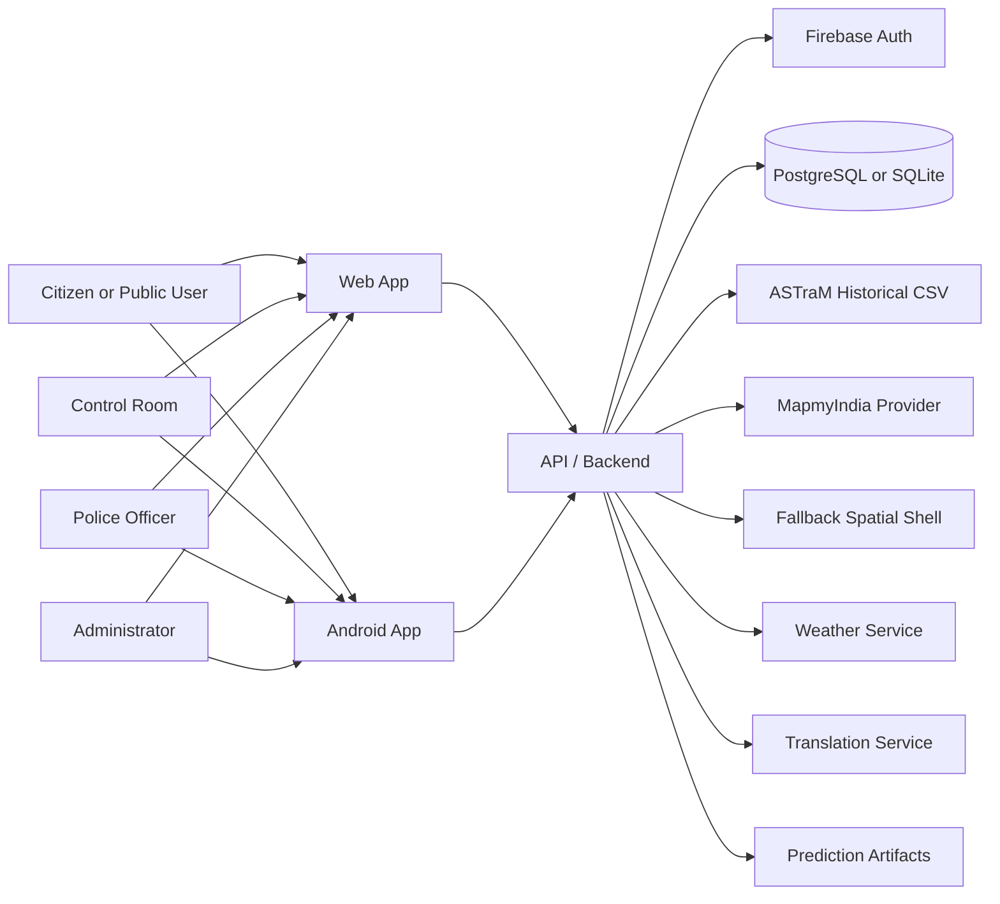

### Runtime Layering

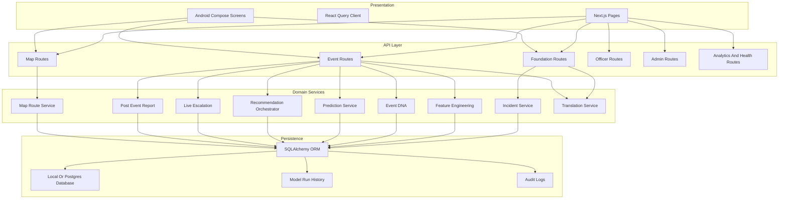

### Core Design Characteristics

The present codebase is built around five consistent design choices.

1. Role-aware access is enforced on the backend.
2. Historical event memory is persisted, not just computed in-session.
3. Prediction and planning are explainable enough to be surfaced directly in the UI.
4. Spatial services sit behind a provider adapter instead of leaking vendor-specific logic into every screen.
5. Learning is stored as a first-class output through post-event reporting, not treated as an afterthought.

---

## End-To-End Operating Loop

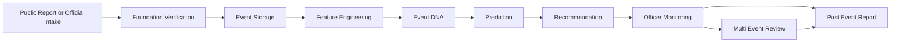

The loop is not just conceptual.
Each stage is mapped to concrete backend routes, service modules, stored tables, and corresponding pages in the web client.

---

## Frontend Architecture

The web frontend is a Next.js application built with React 18 and TypeScript.
It uses TanStack Query for server-state fetching and caching.
It also uses Firebase on the client for identity state, then forwards protected calls to the backend where final authorization happens.

### Frontend Building Blocks

| Frontend block | Current implementation |
| --- | --- |
| Framework | Next.js 14 |
| Rendering model | App Router pages in `frontend/app/` |
| State for remote data | TanStack Query |
| Session UI state | Local stores in `frontend/lib/stores/` |
| Identity state | Firebase web SDK |
| Charts | `chart.js` and `react-chartjs-2` |
| Navigation | `TopNav` and `GlobalSidebar` |
| Language support | `LanguageProvider`, `LanguageSwitcher`, Google Translate widget injection |
| Styling | Tailwind-based utility styling and custom shell panels |

### Layout Shell

The root layout in `frontend/app/layout.tsx` mounts:

- `GoogleTranslate`,
- `LanguageProvider`,
- `AppProviders`,
- `TopNav`,
- and `GlobalSidebar`.

That means translation, navigation, and React Query are available across the web app by default.

### Frontend Navigation Model

The top navigation and sidebar expose four route groups.

| Group | Screens |
| --- | --- |
| Portals | command center, control room, officer portal, admin portal, user mode |
| Dashboards | map intelligence, explorer, reports |
| Intelligence | model insights, simulation, post-event learning |
| System | settings |

This structure mirrors the operational split in the backend.
Public reporting sits alongside, but separate from, internal intelligence tooling.

---

## Web Routes And Product Surfaces

The web app is intentionally split across dedicated screens instead of forcing every workflow into one dashboard.

| Route | Surface | Purpose |
| --- | --- | --- |
| `/` | Public shell | Landing surface backed by the foundation user mode |
| `/user` | User mode | Public incident intake, browsing, and citizen-facing shell |
| `/reports` | Traffic report form | Submit congestion or traffic issue signals into the event-intelligence report pipeline |
| `/control-room` | Control-room shell | Foundation triage, station workflow, incident status transitions |
| `/command-center` | Command center | Product overview, counts, corridor risk timeline, navigation to major tools |
| `/simulation` | Internal simulator | Create a scenario, generate Event DNA, predict impact, and build a plan |
| `/map-intelligence` | Spatial intelligence | Routes, geocode, overlays, hotspots, and multi-event conflict map context |
| `/events/[id]` | Protected event dossier | Detailed event page with DNA, predictions, recommendations, similar events, reports, and live updates |
| `/officer` | Officer workspace | Officer assignment view and live field update submission |
| `/admin` | Admin console | Health, demo actions, feature generation, officer creation, control-room creation, and governance |
| `/explorer` | Protected explorer | Browse hotspot clusters and open an event dossier by ID |
| `/model-insights` | Model visibility | Artifact status and latest recorded training metadata |
| `/post-event-learning` | Learning report | Generate and inspect after-action summaries |
| `/settings` | Demo readiness | Deterministic demo seed and readiness checks |
| `/login` | Sign-in entry | Shared authentication route |

### Product Surface Map

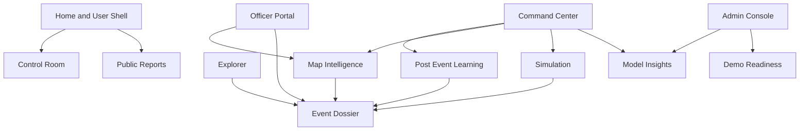
---

## Backend Architecture

The backend is a FastAPI application in `backend/app/`.
The application is assembled in `backend/app/main.py`.

The startup path currently does four important things.

1. Imports ORM modules so the schema is known.
2. Initializes Firebase using backend configuration.
3. Creates the FastAPI application with a lifespan context.
4. Starts the background route fetch loop used by the map layer.

### Backend Composition

| Layer | Current responsibility |
| --- | --- |
| `api/` | Route definitions and request/response contracts |
| `services/` | Domain behavior, scoring, orchestration, report logic, map logic, and learning |
| `orm/` | SQLAlchemy table models |
| `core/` | settings, security, Firebase setup, database helpers, role resolution |
| `db/` | base metadata, session bootstrapping |
| `ml/` | feature pipeline, model loading, and training scripts |
| `scripts/` | ingestion, seeding, rebuilding, and utility tasks |
| `tests/` | backend verification coverage |

### Application Wiring

The app includes the following route groups at startup.

- health,
- command center,
- foundation,
- admin,
- datasets,
- demo,
- analytics,
- events,
- live updates,
- map,
- officer,
- post-event,
- recommendations,
- reports,
- translation,
- and corridor analytics.

### Backend Request Path

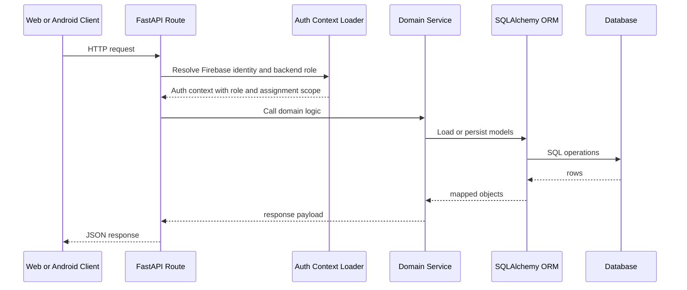

---

## Backend Route Families

The route families below are the implemented API surface, grouped by function rather than by source file.

### Health And Summary

| Path | Purpose |
| --- | --- |
| `GET /api/health` | Backend heartbeat, database state, model artifact state, Firebase config state |
| `GET /api/command-center/summary` | Top-level command center counters |
| `GET /api/analytics/summary` | Analytics summary for internal dashboards |
| `GET /api/analytics/hotspots` | Hotspot list for explorer and map tooling |
| `GET /api/analytics/model-runs` | Stored model training run history |
| `POST /api/analytics/hotspots/rebuild` | Rebuild hotspot analytics |
| `GET /api/analytics/corridor-risk-timeline` | Corridor time-series panel for command center |

### Foundation Incident Layer

| Path | Purpose |
| --- | --- |
| `GET /api/foundation/access` | Current access view |
| `GET /api/foundation/incidents` | Public browse feed with incidents and hotspots |
| `GET /api/foundation/incidents/{incident_id}` | Single foundation incident |
| `POST /api/foundation/incidents/{incident_id}/vote` | Public or signed-in vote signal |
| `POST /api/foundation/incidents/report` | Public incident intake |
| `GET /api/foundation/control-room` | Protected control-room foundation view |
| `POST /api/foundation/control-room/incidents` | Official incident creation |
| `PATCH /api/foundation/control-room/incidents/{incident_id}/status` | Protected status transitions |
| `GET /api/foundation/admin/overview` | Admin governance overview |
| `PATCH /api/foundation/admin/incidents/{incident_id}` | Incident edits |
| `DELETE /api/foundation/admin/incidents/{incident_id}` | Incident deletion |
| `POST /api/foundation/admin/incidents/{incident_id}/escalate` | Manual incident escalation |
| `PATCH /api/foundation/admin/stations/{station_id}` | Station edits |
| `PATCH /api/foundation/admin/users/{user_id}` | User activation edits |
| `DELETE /api/foundation/admin/votes/{vote_id}` | Vote deletion |
| `GET /api/foundation/admin/summary` | Admin counts |
| `POST /api/foundation/admin/seed` | Seed foundation sample data |

### Event Intelligence Layer

| Path | Purpose |
| --- | --- |
| `GET /api/events/{event_id}` | Protected event dossier |
| `POST /api/events/simulate` | Internal simulation endpoint |
| `POST /api/events/rebuild-dna` | Batch Event DNA rebuild |
| `POST /api/events/multi-event-analysis` | Conflict analysis across multiple events |
| `POST /api/recommendations/event-plan` | Generate or refresh a recommendation plan |
| `POST /api/events/{event_id}/live-update` | Add a live field update |
| `POST /api/events/{event_id}/post-event-report` | Generate a post-event report |

### Report Intake And Translation

| Path | Purpose |
| --- | --- |
| `POST /api/reports/congestion` | Congestion or traffic intelligence signal submission |
| `POST /api/translation/normalize` | Text normalization and translation helper |

### Spatial And Map Layer

| Path | Purpose |
| --- | --- |
| `GET /api/map/config` | Provider state and public-safe map configuration |
| `POST /api/map/route` | Protected route computation |
| `POST /api/map/geocode` | Protected address geocoding |
| `GET /api/map/active-routes` | Cached route overlays for active incidents |

### Datasets And Demo Tooling

| Path | Purpose |
| --- | --- |
| `POST /api/datasets/load-demo` | Load demo dataset records |
| `POST /api/datasets/upload` | Upload a dataset file |
| `POST /api/datasets/generate-features` | Build event features |
| `GET /api/demo/status` | Demo readiness checks |
| `POST /api/demo/seed` | Deterministic demo refresh |

### Officer And Admin Identity Operations

| Path | Purpose |
| --- | --- |
| `POST /api/officer/login` | Officer access handshake |
| `GET /api/officer/assignments` | Officer profile and assignment scope |
| `GET /api/admin/stations` | Station list |
| `POST /api/admin/officers` | Create officer account and profile |
| `POST /api/admin/control-room-users` | Create internal control-room user |

---

## Core Service Layer

The service layer is where the real product behavior lives.
The route files stay fairly thin and the service modules own the operational logic.

### Service Ownership Map

| Service module | Responsibility |
| --- | --- |
| `incident_service.py` | Foundation incident votes, status transitions, escalation triggers |
| `feature_engineering_service.py` | Derive event features from stored events |
| `hotspot_service.py` | Rebuild hotspot clusters and risk metrics |
| `event_dna_service.py` | Generate event narrative and structured context |
| `similar_event_service.py` | Retrieve historically aligned events |
| `prediction_service.py` | Priority, closure, clearance, impact, and explanation assembly |
| `road_closure_scoring_service.py` | Rule-based road-closure likelihood support |
| `resolution_time_service.py` | Clearance estimate logic |
| `manpower_service.py` | Officer count and deployment style guidance |
| `barricade_service.py` | Barricade unit and placement guidance |
| `diversion_service.py` | Diversion logic and feeder-road guidance |
| `emergency_corridor_service.py` | Emergency-lane protection guidance |
| `logistics_impact_service.py` | Dispatch and logistics posture summary |
| `recommendation_orchestrator.py` | Joins prediction and plan outputs into one recommendation payload |
| `live_escalation_service.py` | Officer updates and adaptive plan responses |
| `multi_event_service.py` | Simultaneous event conflict scoring |
| `post_event_report_service.py` | After-action report generation |
| `map_route_service.py` | Route, geocode, provider guardrails, cache, and fallback logic |
| `translation_service.py` | Text translation and normalization bridge |
| `weather_service.py` | Manual weather profiles and live weather lookup |
| `corridor_risk_service.py` | Corridor timeline analytics |
| `foundation_seed_service.py` | Seed the foundation incident layer |
| `demo_scenario_service.py` | Build deterministic demo scenarios across the event stack |

### Service Interaction Diagram

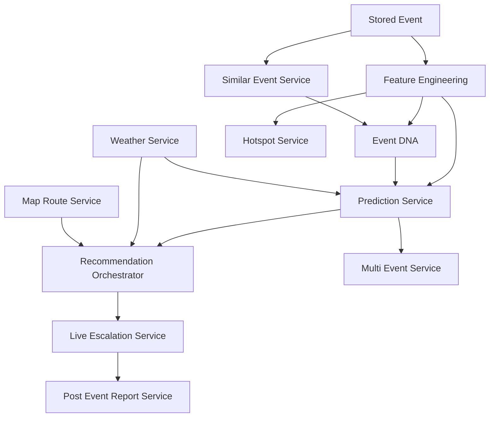

---

## Data Sources And Ingestion

The historical source file currently present at the repository root is:

```text
Astram event data_anonymized - Astram event data_anonymizedb40ac87 (1).csv
```

The header in that file shows that the dataset already contains raw spatial, temporal, operational, and narrative fields.
Key examples include:

- `id`,
- `event_type`,
- `latitude`,
- `longitude`,
- `endlatitude`,
- `endlongitude`,
- `address`,
- `event_cause`,
- `requires_road_closure`,
- `start_datetime`,
- `end_datetime`,
- `status`,
- `description`,
- `veh_type`,
- `corridor`,
- `priority`,
- `reason_breakdown`,
- `police_station`,
- `resolved_at_address`,
- `closed_datetime`,
- `resolved_datetime`,
- `zone`,
- and `junction`.

### Ingestion Principles In Code

The ingestion path in `data_cleaning_service.py` does more than copy CSV rows into the database.
It also:

- validates required columns,
- parses timestamps safely,
- validates coordinates,
- normalizes event causes,
- normalizes description text,
- strips sensitive fields from raw payload storage,
- masks vehicle numbers,
- cleans reason breakdown fields,
- and upserts events into the main event table.

### Raw To Stored Flow

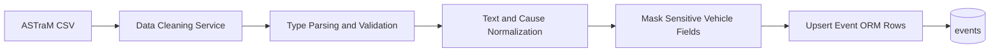

### Data Families Used By The System

| Data family | Where it comes from | Where it is used |
| --- | --- | --- |
| Historical event records | ASTraM CSV and seeded demo scenarios | features, hotspots, Event DNA, similar events, predictions |
| Public signals | report submission endpoints | report confidence, event matching, dossier context |
| Official incident intake | foundation control-room and admin routes | station workflow, public incident layer |
| Officer updates | officer portal and protected live update route | live escalation timeline and post-event learning |
| Weather context | manual selectors and weather service | impact and recommendation adjustment |
| Spatial context | event lat-lng, corridors, stations, map provider responses | route overlays, impact radius, geocode, conflict analysis |

---

## Database Model

The codebase uses SQLAlchemy ORM models to persist both the foundation layer and the event intelligence layer.

The persistence model matters because the system is not just producing transient JSON responses.
It stores the event, its engineered features, its narrative fingerprint, its predictions, its recommendations, its live updates, and its post-event learning trail.

### Entity Relationship View

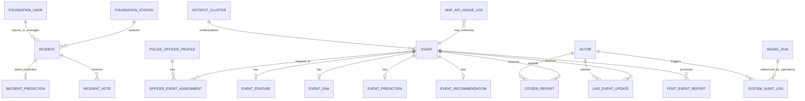

### Main Persistence Groups

| Group | Key tables |
| --- | --- |
| Identity and governance | `actors`, `police_officer_profiles`, `officer_event_assignments`, `system_audit_logs` |
| Foundation incident layer | `incidents`, `incident_predictions`, `incident_votes`, `foundation stations/users` response models |
| Event intelligence core | `events`, `event_features`, `event_dna`, `event_predictions`, `event_recommendations` |
| Feedback and monitoring | `citizen_reports`, `live_event_updates`, `post_event_reports` |
| Analytics and infrastructure | `hotspot_clusters`, `model_runs`, `map_api_usage_logs` |

### Event Core Record

The `events` table is the operational spine of the intelligence layer.
It stores:

- event type,
- event cause and normalized cause,
- lat-lng,
- address context,
- corridor,
- police station,
- zone,
- junction,
- priority,
- road-closure flag,
- description and description normalization fields,
- vehicle type,
- lifecycle timestamps,
- and a stripped raw payload.

### Why The Schema Matters

The schema is what allows the event dossier page to work as a joined narrative instead of as a one-off inference result.
By the time an event reaches `/events/[id]`, the page can load one coherent record built from multiple persisted layers.

- the event itself,
- its engineered features,
- its Event DNA,
- its latest prediction,
- its latest recommendation,
- linked reports,
- linked live updates,
- and linked post-event output.

---

## Foundation Incident Layer

The foundation layer is the public-facing operational shell for verified incident intake and station workflow.
It is implemented in the frontend through `FoundationShell` and in the backend through `routes_foundation.py` plus `incident_service.py`.

### What The Foundation Layer Does

- accepts public incident reports,
- shows active and reported incidents,
- supports voting and confidence reinforcement,
- maps incidents to stations,
- allows control-room creation of official incidents,
- supports controlled status transitions,
- and gives admin users the ability to review, correct, escalate, or remove records.

### Foundation Status Logic

The code supports operational states such as:

- reported,
- pending_verification,
- active,
- escalated,
- resolved,
- and rejected.

Votes and protected actions can move an incident through that lifecycle.
The service logic prevents invalid transitions and supports automatic promotion when vote and confidence thresholds are met.

### Foundation Flow

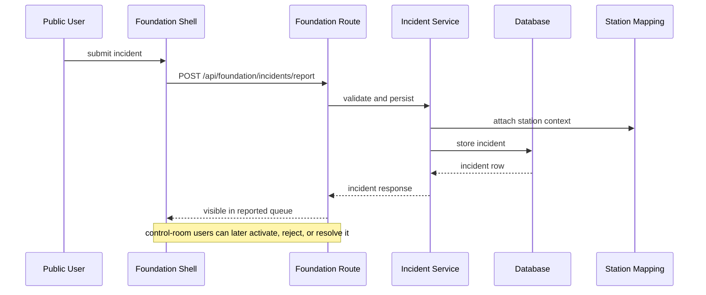

### Foundation Frontend Responsibilities

The shared foundation shell currently handles:

- overview,
- report panel,
- official incident panel,
- incident list,
- details panel,
- route panel,
- station contact context,
- map panel with active and pending markers,
- and route overlays for active incidents.

That makes the foundation layer useful even before the deeper event-intelligence flow begins.
---

## Event Intelligence Layer

The event intelligence layer is the part of the system that turns a stored event into an operationally useful command object.
It begins with a concrete event record and expands that record into a dossier.

The dossier is not a single model output.
It is a stitched view of:

- event storage,
- engineered features,
- Event DNA,
- similar-event memory,
- prediction output,
- recommendation output,
- report history,
- live escalation history,
- and learning output.

### Event Dossier Assembly

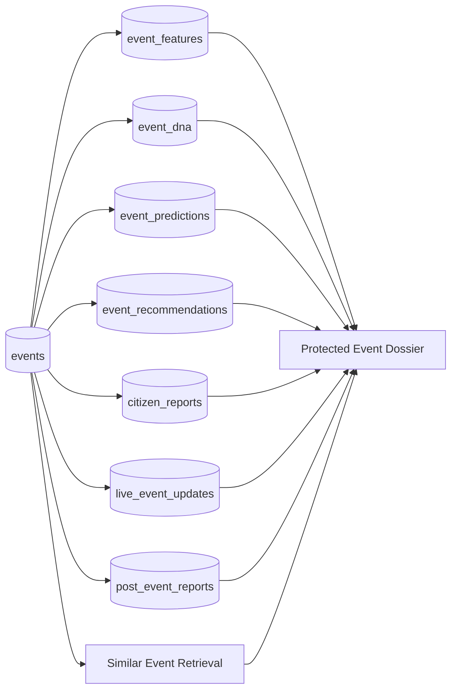

### Intelligence Records Around An Event

| Stored layer | What it contributes |
| --- | --- |
| `event_features` | Structured inputs derived from history and timestamps |
| `event_dna` | Human-readable operating fingerprint and memory context |
| `event_predictions` | Priority, closure, clearance, impact, and supporting explanation |
| `event_recommendations` | Actionable response plan and confidence ledger |
| `citizen_reports` | Corroborating public signal history |
| `live_event_updates` | Field escalation trail and adaptive actions |
| `post_event_reports` | After-action summary and lessons learned |

---

## Event DNA

Event DNA is the narrative fingerprint of an event.
The backend constructs it so the UI can explain why the system sees the event as risky or familiar, rather than only printing a score.

### Event DNA Structure In The Current Build

The dossier UI and the stored `event_dna` model are built around the following fields.

- `dna_summary`
- `time_context`
- `location_context`
- `cause_context`
- `weather_context`
- `multi_event_context`
- `historical_pattern`
- `risk_indicators_json`
- `similar_event_ids_json`

### Event DNA Card Breakdown

| DNA section | What it explains |
| --- | --- |
| Time context | Hour, weekday, weekend status, peak-hour context, duration fallback |
| Location context | Corridor, station, zone, junction, cluster ID |
| Cause context | Event cause, type, priority, closure note, description normalization note |
| Historical pattern | Corridor, station, cluster, and cause-based historical rates |
| Risk indicators | Structured flags such as weekend, peak hour, closure flag, unplanned flag |
| Similar-event memory | Historical event matches used to ground reasoning |

### Event DNA Generation Flow

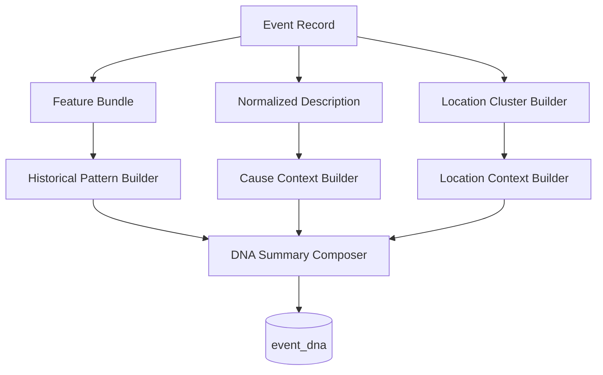

Event DNA is one of the reasons the dossier page feels operational rather than purely statistical.
It gives internal users a way to read the event as a recognizable pattern.

---

## Prediction Stack

The prediction layer is assembled primarily in `prediction_service.py` and supporting services.
It is a hybrid stack that mixes persisted historical features, rule-based scoring, optional model artifacts, and contextual modifiers such as weather and similar-event memory.

### Prediction Outputs Stored Per Event

| Output | Meaning |
| --- | --- |
| Predicted priority | High or low urgency classification |
| Priority confidence | Confidence score attached to priority |
| Road-closure probability | Operational probability signal |
| Predicted road-closure flag | Boolean helper derived from probability and rules |
| Estimated clearance minutes | Time-to-clear estimate |
| Impact score | Overall operational disruption score |
| Impact category | Low, medium, high, or critical-style bucket used by UI |
| Estimated impact radius | Approximate spatial effect radius |
| Baseline score | Score before event-specific adjustments |
| Additional delta | Change from baseline to event-adjusted output |
| Weather adjustment | Structured modifier details |
| Multi-event conflict context | Optional overlapping-event context |
| Explanation JSON | Reason codes and supporting narrative |

### Prediction Input Families

| Input family | Examples |
| --- | --- |
| Raw event fields | event type, cause, corridor, station, vehicle type, description |
| Engineered feature fields | event hour, weekday, weekend flag, historical corridor risk, historical cluster closure rate |
| Similar-event memory | top matches, structured similarity, historical pattern reinforcement |
| Weather context | manual selector or live weather lookup |
| Resolution averages | per-vehicle-type duration patterns |

### Feature Engineering In The Current Build

The feature-engineering layer derives values such as:

- `event_hour`,
- `event_day`,
- `event_month`,
- `event_weekday`,
- `is_weekend`,
- `is_peak_hour`,
- `is_night_event`,
- `event_duration_minutes`,
- `closure_duration_minutes`,
- `resolution_duration_minutes`,
- `duration_source`,
- `location_cluster_id`,
- `historical_corridor_risk`,
- `historical_police_station_risk`,
- `historical_cluster_risk`,
- `historical_cause_closure_rate`,
- `historical_corridor_closure_rate`,
- `historical_police_station_closure_rate`,
- and `historical_cluster_closure_rate`.

These fields are persisted in `event_features`, not just rebuilt on page load.

### Simulation Flow

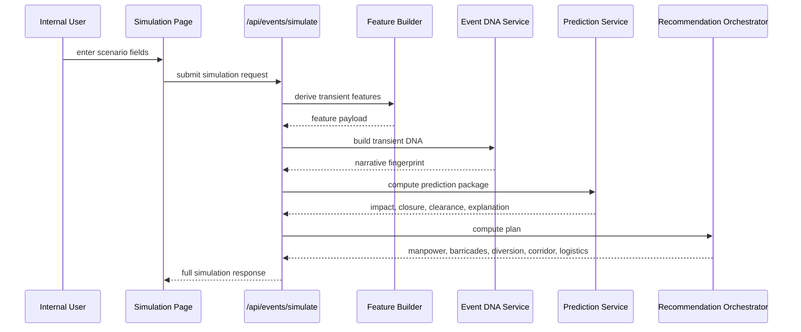

### Priority Model

The current training path for priority uses a tree-based classifier pipeline over:

- event type,
- normalized event cause,
- corridor,
- police station,
- event hour,
- event weekday,
- peak-hour flag,
- historical corridor risk,
- and historical police-station risk.

The current model-insights presentation labels this output as a predicted urgency bucket rather than as a guarantee.

### Road-Closure Logic

Road-closure handling is intentionally conservative.
The codebase treats probability as the primary operational signal and the boolean road-closure field as an assistive helper for planning and display.

### Resolution-Time Logic

Resolution-time estimation draws from:

- qualifying historical rows,
- filtered reliable timestamps,
- and vehicle-type-aware duration patterns.

The result is displayed as an estimate.
The UI and backend wording do not represent that number as a committed clearance promise.

---

## Recommendation Engine

Prediction alone is not the end state in this product.
The recommendation layer translates prediction into an operational plan that a human can inspect and act on.

### Recommendation Sections In The Stored Model

| Section | Purpose |
| --- | --- |
| Risk summary | Short narrative of the risk posture |
| Weather risk | Rain, visibility, waterlogging, source, and reason codes |
| Manpower plan | Officer count, reserve, sector count, style, officer gap |
| Barricade plan | Unit estimate, coverage radius, control points |
| Diversion plan | Corridor protection and feeder-road logic |
| Emergency corridor | Protected lane guidance and trigger language |
| Logistics impact | Dispatch or shipment posture |
| Confidence ledger | Why the plan should be read with the right level of trust |
| Recommended action summary | One readable operational paragraph |

### Recommendation Orchestration Flow

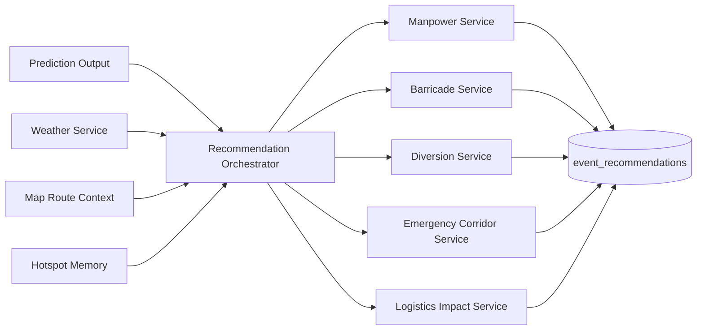

### What The Plan Looks Like In The UI

The simulation page and event dossier expose the plan as operational cards rather than as a dense JSON blob.
The user sees sections such as:

- officer deployment posture,
- barricade plan,
- diversion plan,
- emergency corridor,
- logistics impact,
- and the action confidence ledger.

### Confidence Ledger

The confidence ledger is an important part of the current implementation.
It explains why the system trusts part of the plan and where certainty drops.

The current ledger can reference signals such as:

- historical event coverage,
- priority and impact estimate confidence,
- road-closure likelihood confidence,
- weather modifier confidence,
- manpower and diversion heuristic confidence,
- and absence of live traffic-speed telemetry.

This makes the recommendation layer visibly honest about the strength of each input family.

---

## Live Escalation Loop

The live escalation loop connects field conditions back into the recommended plan.
It is implemented through the officer portal, the live-update route, the `live_event_update` table, and the live escalation service.

### Officer Update Input Shape

A protected live update can include:

- congestion level,
- free-text field update,
- road-closure flag,
- officer shortage flag,
- crowd increase flag,
- rain or waterlogging flag,
- nearby incident flag,
- current impact score,
- deviation from predicted impact,
- alert level,
- and adaptive action text.

### Live Escalation Flow

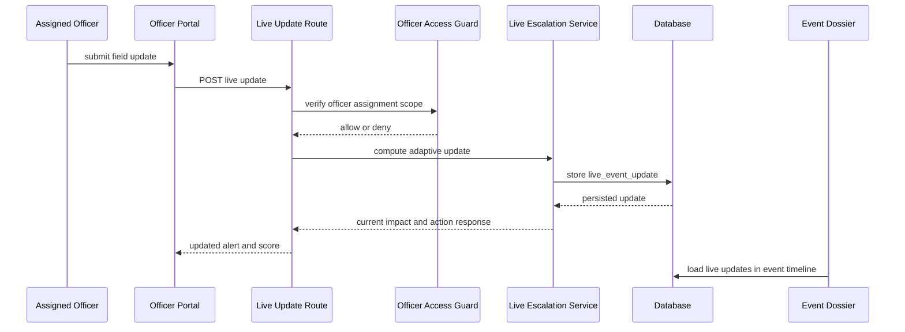

### Why This Matters

Without the live-update layer, the system would stop at prediction and planning.
With this layer, the platform can show how real field conditions diverge from the original expected impact and how the plan should adapt.

---

## Multi-Event Coordination

The current build can compare multiple active or planned events and score overlap pressure.
That logic lives in `multi_event_service.py` and is surfaced through `/api/events/multi-event-analysis` plus the map-intelligence UI.

### Conflict Signals Used By The Service

The multi-event analyzer currently considers signals such as:

- time overlap,
- impact-radius overlap,
- nearby event radius,
- shared corridor,
- shared police station,
- diversion route conflict,
- and officer gap.

### Multi-Event Analysis Flow

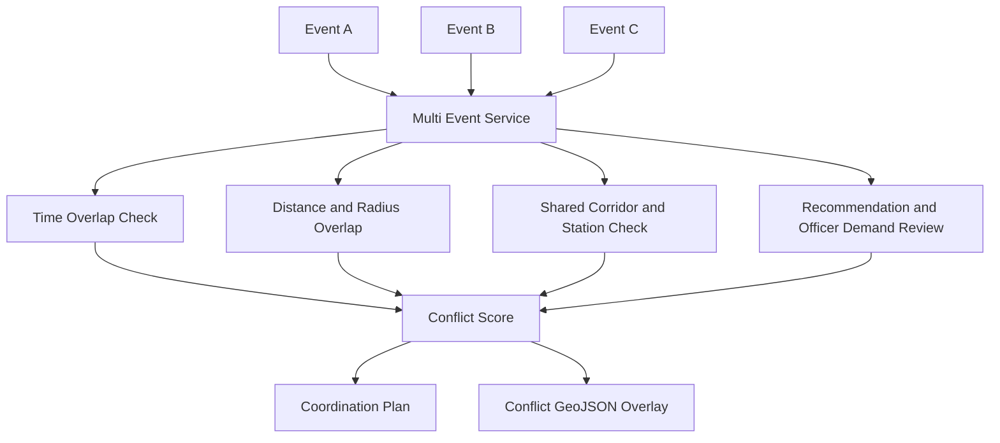

### Output Shape

The service returns a coordination result that includes:

- whether a conflict exists,
- number of high conflicts,
- officer demand,
- officer gap,
- event pair detail,
- conflict labels,
- coordination plan language,
- and a spatial overlay used by the map screen.

This is why the map-intelligence page can present simultaneous-event conflict analysis rather than just showing markers on a map.

---

## Post-Event Learning

Post-event learning is stored, not improvised.
The backend can generate a report after an event is resolved, using the stored event, reports, live updates, prediction output, and recommendation output.

### Post-Event Report Contents

| Section | Purpose |
| --- | --- |
| Predicted impact | What the system expected |
| Observed impact | What was seen by the end of the event |
| Deviation | Gap between predicted and observed impact |
| Reports considered | Public or field signals that fed the review |
| Prediction summary | Human-readable recap of the original estimate |
| Recommendation summary | Human-readable recap of the operational plan |
| Citizen report summary | How public reports aligned with outcome |
| Live escalation summary | How field updates changed the story |
| Lessons learned | Reusable takeaways |
| Future recommendations field | Stored next-time guidance generated from current event history |
| Structured learning snapshot | Compact machine-readable summary stored inside `report_json` |

### Post-Event Learning Flow

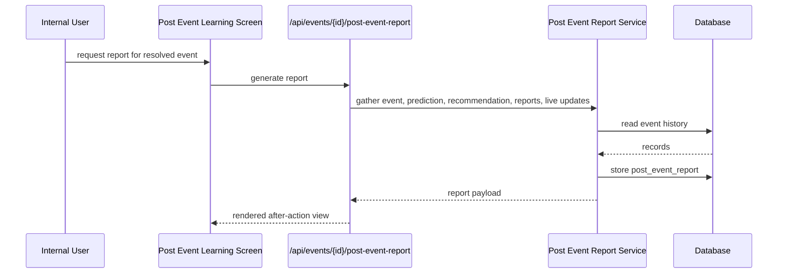

### Why It Matters

The learning layer closes the traffic-operations loop in the product.
A system that only predicts and recommends can still be useful.
A system that also records how well those recommendations held up becomes reusable over time.
---

## Map And Spatial Intelligence

The spatial layer is centered on `routes_map.py`, `map_route_service.py`, the background route fetcher, and the `map-intelligence` frontend page.

The design in code is provider-based.
A primary provider is configured, a fallback provider is configured, and route and geocode calls flow through the backend rather than directly from the UI to the external provider.

### Map Responsibilities In The Current Build

- expose provider state to the UI,
- compute route overlays for protected workflows,
- geocode protected address lookups,
- prefetch active routes in the background,
- expose cached active-route overlays,
- provide hotspot and conflict overlays to map screens,
- track API usage in backend storage,
- and degrade safely when the primary provider is unavailable or blocked by budget guardrails.

### Provider Model

| Layer | Current behavior |
| --- | --- |
| Primary provider | MapmyIndia / Mappls route and geocode path |
| Fallback provider | fallback spatial shell and local route overlay behavior |
| Budget control | credit budget and soft-limit checks live in backend config and service logic |
| Client exposure | frontend receives provider status, not raw secrets |
| Background prefetch | active routes are refreshed in a background loop |

### Map Provider Decision Flow

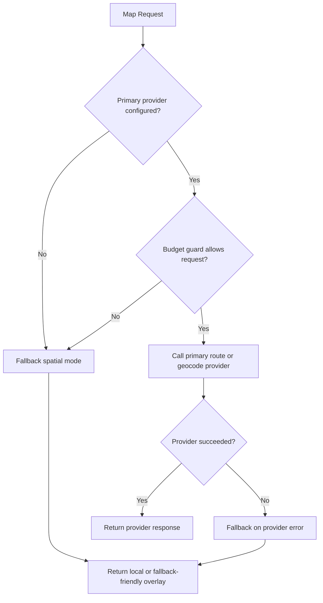

### Active Route Background Loop

The backend starts `_fetch_routes_loop()` during application lifespan.
That loop refreshes route overlays for active incidents so the map surface can show current path context without making every page load responsible for route recomputation.

### Spatial Views In The Web App

| Screen | Spatial use |
| --- | --- |
| Foundation shell | incident points, hotspots, and active route overlays |
| Map intelligence | hotspots, route overlay, geocode result, event markers, report markers, multi-event conflict geometry |
| Explorer | hotspot cluster browsing |
| Event dossier | event-centered map context and route-aware recommendation understanding |
| Officer portal | assignment route context and live update coordination |

### Search Markers And Overlays

The map-intelligence page uses multiple marker types and overlays to support different operational questions.

- Event markers show event positions.
- Report markers show submitted report locations.
- Hotspot layers show cluster density and risk ranking.
- Conflict overlays show simultaneous-event overlap context.
- Route overlays show the current planned or cached route line.
- Search markers represent geocode results or user-requested lookup points on the map shell.

### What The Map Layer Is Not Doing

The current codebase does not implement a live streaming traffic-speed feed.
The recommendation confidence ledger explicitly calls this out.
The map layer is therefore used for route shape, spatial clustering, geocode, and conflict context rather than as a live telemetry dashboard.

---

## Translation And Multilingual Flow

Multilingual handling exists in both the web stack and the Android stack.

### Web Translation Pieces

| Component | Purpose |
| --- | --- |
| `GoogleTranslate.tsx` | Injects the Google Translate widget into the web shell |
| `LanguageProvider` | Client-side language state |
| `LanguageSwitcher` | UI language switch control |
| `translation_service.py` | Backend translation and normalization service |
| `routes_translation.py` | Translation API endpoint |
| report ingestion | Preserves and normalizes report description text |

### Backend Translation Behavior

The backend translation path can:

- detect the source language when needed,
- translate into English for reasoning,
- preserve the original text for auditability,
- report translation status,
- and respect configured budget guardrails.

### Why Translation Matters Operationally

The current event and report stack relies heavily on description text.
Translated and normalized text is used in:

- report confidence calculation,
- event matching,
- Event DNA narrative,
- and stored audit context.

### Translation Flow

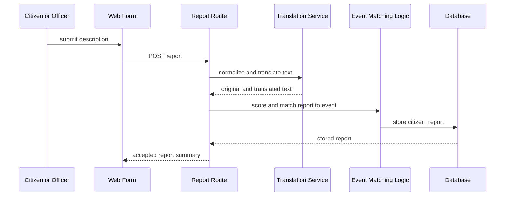

---

## Authentication And Authorization

Identity and access are split by design.
The frontend knows whether a user is signed in.
The backend decides whether that user can perform the requested action.

### Access Model In Practice

| Stage | Current behavior |
| --- | --- |
| Identity proof | Firebase token or client auth state |
| Backend role load | actor record resolved from backend storage |
| Officer scope load | officer profile and event/corridor/zone/station assignments |
| Route guard | route checks role plus assignment scope |
| Response shaping | public, officer, control-room, and admin responses differ by route |

### Auth Flow

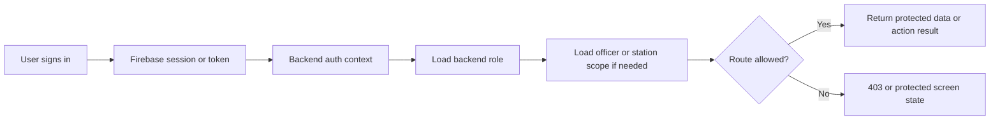

### Important Authorization Facts In The Current Build

- Public reporting routes can accept citizen submissions without requiring an internal login.
- Protected internal routes still require backend validation even if Firebase says the user is authenticated.
- Officer routes can fail even with a valid officer sign-in if the officer is not assigned to the target event or compatible scope.
- Admin routes can create officer and control-room accounts, but the act of being signed in alone does not make a user an admin.
- The dossier page, multi-event route, live-update route, and post-event route all participate in assignment-aware access checks.

### Officer Scope Logic

The officer access helper can allow access through:

- explicit event assignment,
- corridor match,
- zone match,
- or police-station match.

That is why an officer can see a meaningful assignment list instead of only one static event.

---

## Model Artifacts And Training Scripts

The repository contains training scripts and artifact-loading logic for the three prediction families surfaced in model insights.

### Trained Families Exposed By The Product

| Family | Current purpose |
| --- | --- |
| Priority | classify event urgency |
| Road closure | estimate closure likelihood support |
| Resolution time | estimate time to clear |

### Training Scripts Present In The Repo

| Script | Purpose |
| --- | --- |
| `backend/app/ml/train_priority_model.py` | Train the priority model and record model-run metadata |
| `backend/app/ml/train_road_closure_model.py` | Train the road-closure support model |
| `backend/app/ml/train_resolution_time_model.py` | Train the clearance-time model |
| `backend/scripts/export_ml_features.py` | Export feature sets |
| `backend/scripts/kaggle_xgboost_training_gpu.py` | Additional training utility present in the repo |

### Artifact Loading Rules

The health route and model-insights page both depend on backend artifact state.
The loader checks whether the artifact exists and whether optional ML dependencies are available.

The visible artifact states are:

- loaded,
- dependency missing,
- and not loaded.

### Model Run Metadata

Each successful or skipped training run can write metadata to `model_runs`.
That gives the product a way to show:

- latest run time,
- metrics for the trained family,
- artifact path,
- training row count,
- test row count,
- target variable,
- and feature list.

### Artifact Locations

| Model family | Script | Stored artifact |
| --- | --- | --- |
| Priority | `backend/app/ml/train_priority_model.py` | `backend/app/models/xgboost_priority_model.pkl` |
| Road closure | `backend/app/ml/train_road_closure_model.py` | `backend/artifacts/road_closure_model.joblib` |
| Resolution time | `backend/app/ml/train_resolution_time_model.py` | `backend/artifacts/resolution_time_model.joblib` |

### ML Lifecycle Diagram

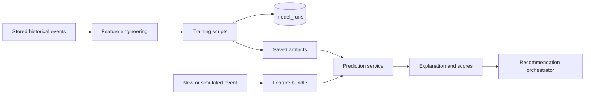
### Why Model Insights Exists

The model-insights page is not just a vanity screen.
It tells the operator whether the platform is currently using:

- a loaded artifact,
- a saved artifact with missing dependencies,
- or pure fallback logic.

That is important because the current product always remains functional even when some artifacts are missing.
Fallback logic is a first-class operational path, not a crash state.

---

## Android App Module

The Android application lives under `app/` and uses a Kotlin Compose structure.
It is not a separate idea disconnected from the web stack.
It mirrors the main product surfaces in mobile form.

### Android Module Layout

| Android package area | Role |
| --- | --- |
| `navigation/` | screen destinations and app navigation |
| `feature/` | user-facing screens grouped by feature |
| `data/` | local and remote data abstractions |
| `core/` | shared translation and reporting helpers |
| `design/` | theme and design system pieces |
| `domain/` | platform-level state and model contracts |

### Android Destination Set

The current navigation enum includes screens for:

- overview,
- auth,
- citizen,
- officer,
- map,
- admin,
- model insights,
- explorer,
- simulation,
- and post-event learning.

### Mobile Translation Support

The Android codebase includes a translation manager built around ML Kit.
That means mobile translation is not just a web-only concern.


---

## Testing And Verification Coverage

The backend test suite is broad and maps closely to the main operating flows.

### Test Families Present In `backend/tests/`

| Test file | Coverage area |
| --- | --- |
| `test_health.py` | backend heartbeat and health payload |
| `test_config.py` | configuration behavior |
| `test_database.py` | database wiring |
| `test_data_cleaning.py` | CSV ingestion and cleaning |
| `test_feature_engineering.py` | engineered event features |
| `test_hotspot_service.py` | hotspot rebuilding |
| `test_event_dna.py` | Event DNA generation |
| `test_similar_events.py` | similar-event retrieval |
| `test_predictions.py` | prediction stack |
| `test_impact_score.py` | impact score logic |
| `test_road_closure_scoring.py` | closure scoring |
| `test_resolution_time.py` | clearance estimation |
| `test_recommendations.py` | plan generation and access boundaries |
| `test_live_escalation.py` | live updates and adaptive actions |
| `test_multi_event_service.py` | overlap and officer-gap logic |
| `test_post_event_report.py` | after-action generation |
| `test_citizen_reports.py` | public report ingestion |
| `test_translation_service.py` | translation path |
| `test_weather_service.py` | weather profile logic |
| `test_map_routes.py` | route and geocode behavior |
| `test_officer_routes.py` | officer assignment surfaces |
| `test_security.py` | auth context and officer access |
| `test_admin_routes.py` | admin operations |
| `test_demo_scenarios.py` | deterministic demo setup |
| `test_corridor_risk_timeline.py` | corridor chart API |
| `test_foundation_phase1.py` | foundation workflow rules |
| `test_foundation_phase2.py` | public and control-room incident flows |
| `test_foundation_phase3.py` | admin incident management |
| `test_firebase.py` | Firebase integration edges |

### What That Means Practically

The test coverage is not limited to utility functions.
It includes:

- auth gates,
- officer scope enforcement,
- report intake,
- foundation incident lifecycle,
- route and geocode behavior,
- recommendation generation,
- multi-event analysis,
- and post-event learning.

That is a strong sign that the repository is wired around actual product flows rather than isolated demos.

---

## Local Runbook

This section is intentionally direct.
It describes how the current repository is designed to run locally.

### 1. Create A Virtual Environment

```powershell
python -m venv .venv
.\.venv\Scripts\Activate.ps1
```

If local PowerShell blocks activation:

```powershell
Set-ExecutionPolicy -Scope Process -ExecutionPolicy Bypass
.\.venv\Scripts\Activate.ps1
```

### 2. Install Backend Dependencies

```powershell
pip install --upgrade pip
pip install -r backend\requirements.txt
```

### 3. Install Frontend Dependencies

```powershell
npm install --prefix frontend
```

### 4. Create Local Environment Values

```powershell
Copy-Item .env.example .env
```

### 5. Apply Migrations

```powershell
alembic upgrade head
```

### 6. Load Data And Derived Artifacts

```powershell
python backend\scripts\seed_demo_data.py
python backend\scripts\create_features.py
python backend\scripts\rebuild_hotspots.py
python backend\scripts\rebuild_event_dna.py
```

### 7. Optional Internal Seeds

```powershell
python backend\scripts\seed_foundation_data.py
python backend\scripts\create_demo_scenarios.py
```

### 8. Optional Model Training

```powershell
python backend\app\ml\train_priority_model.py
python backend\app\ml\train_road_closure_model.py
python backend\app\ml\train_resolution_time_model.py
```

### 9. Start The Backend

```powershell
cd backend
python -m uvicorn app.main:app --reload --host 127.0.0.1 --port 8000
```

### 10. Start The Frontend

```powershell
cd frontend
npm run dev
```

### 11. Main Local URLs

| URL | Purpose |
| --- | --- |
| `http://localhost:3000/` | public shell |
| `http://localhost:3000/user` | user mode |
| `http://localhost:3000/reports` | report form |
| `http://localhost:3000/control-room` | foundation control-room flow |
| `http://localhost:3000/command-center` | main internal dashboard |
| `http://localhost:3000/explorer` | hotspot explorer |
| `http://localhost:3000/simulation` | scenario simulator |
| `http://localhost:3000/map-intelligence` | map and overlap analysis |
| `http://localhost:3000/officer` | officer portal |
| `http://localhost:3000/admin` | admin console |
| `http://localhost:3000/model-insights` | model status |
| `http://localhost:3000/post-event-learning` | after-action learning |
| `http://localhost:3000/settings` | demo readiness |
| `http://127.0.0.1:8000/api/health` | backend health check |

### SQLite And PostgreSQL

The backend configuration can run against PostgreSQL or fall back to local SQLite when a database URL is not explicitly set.
That makes local bring-up easier while still keeping the deployment shape compatible with a more standard relational setup.

---

## Repository Structure

```text
FLipkart/
|- app/
|  |- app/
|  |  |- src/main/java/com/namangulati/sancharsarthi/
|  |  |  |- core/
|  |  |  |- data/
|  |  |  |- design/
|  |  |  |- domain/
|  |  |  |- feature/
|  |  |  |- navigation/
|  |- docs/
|- backend/
|  |- app/
|  |  |- api/
|  |  |- core/
|  |  |- db/
|  |  |- ml/
|  |  |- orm/
|  |  |- services/
|  |  |- utils/
|  |- scripts/
|  |- tests/
|- frontend/
|  |- app/
|  |- components/
|  |- lib/
|- .env.example
|- alembic.ini
|- docker-compose.yml
|- README.md
|- RUN_APPLICATION_COMMANDS.md
|- Astram event data_anonymized - Astram event data_anonymizedb40ac87 (1).csv
```

### Repository Reading Order

For someone opening the codebase fresh, the shortest useful reading order is:

1. `frontend/app/layout.tsx` for the shell,
2. `frontend/components/layout/TopNav.tsx` for the route structure,
3. `frontend/components/foundation/FoundationShell.tsx` for the public and control-room foundation layer,
4. `frontend/app/simulation/page.tsx` for the internal planning surface,
5. `frontend/app/map-intelligence/page.tsx` for the spatial layer,
6. `backend/app/main.py` for backend assembly,
7. `backend/app/api/routes_events.py` for the event-intelligence entry points,
8. `backend/app/services/prediction_service.py` and `recommendation_orchestrator.py` for the core reasoning path,
9. `backend/app/services/live_escalation_service.py` and `post_event_report_service.py` for the monitor-and-learn loop,
10. `backend/app/orm/` for persistence design.

---

## Closing Notes

Sachar Sarthi is strongest when read as a traffic-operations system rather than as a generic smart-city dashboard.
The current codebase already has a clear product shape.

- Public users can raise signals.
- Control-room users can verify and manage incidents.
- Internal operators can simulate and plan.
- Officers can feed live field reality back into the event.
- The backend can compare historical memory with new operating context.
- The platform can generate explainable recommendations.
- The same event can be reviewed after resolution so learning becomes reusable.

That end-to-end continuity is the defining quality of the repository.
The system does not stop at a map.
It does not stop at a prediction.
It does not stop at a report form.
It carries an event from intake to operational interpretation to response planning to monitoring to after-action learning, with role boundaries enforced throughout.

That is what the current implementation actually delivers.


