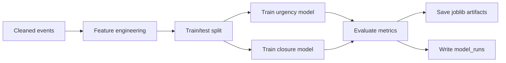
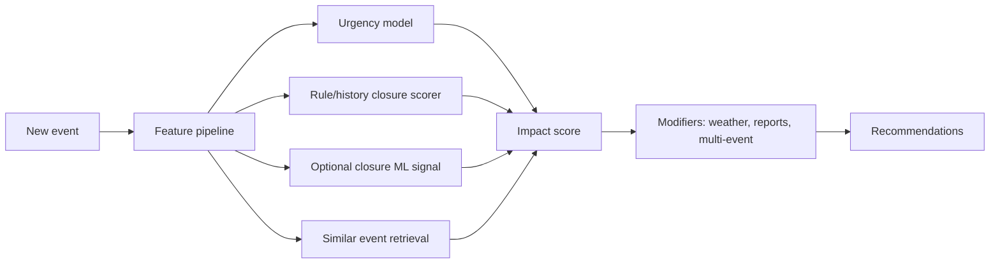

# EventFlow AI AI/ML Architecture

## 1. AI Philosophy

EventFlow AI uses a hybrid AI planning engine:

```text
ML models + geospatial reasoning + rule-based planning + explainability
```

It should not present recommendations as magical. Every output must include confidence, top reasons, and whether it is dataset-backed, predicted, estimated, recommended, or simulated.

## 2. Data Sources

- ASTraM event CSV
- Derived event features
- Citizen/field reports
- Manual or Open-Meteo weather input
- Simplified road graph
- Demo emergency and logistics points

## 3. Models

### Operational Urgency Classifier

- Target: `priority`
- Interpretation: operational urgency
- Dataset reality: the uploaded ASTraM CSV currently contains `High` and `Low` priority labels only.
- MVP output contract: keep `predicted_priority` dataset-backed as `High` or `Low`; use the probability/confidence score for nuance instead of inventing `Medium`.
- Candidate models: Logistic Regression, Random Forest, XGBoost optional
- Metrics: accuracy, precision, recall, F1, confusion matrix

### Road Closure Likelihood Classifier

- Target: `requires_road_closure`
- Dataset reality: in the uploaded ASTraM CSV, `requires_road_closure = TRUE` appears in `676 / 8173` rows, about `8.27%`.
- MVP decision: road-closure likelihood is primarily an explainable rule-based and historical-rate score, not a standalone ML classifier.
- ML role: optional supporting signal only if validation metrics are acceptable.
- Candidate supporting models: Logistic Regression with class_weight, Random Forest with class_weight.
- Metrics: recall True, precision True, F1 True, PR-AUC, confusion matrix, calibration curve.
- UI wording: "Estimated road-closure likelihood", not "accurate road-closure prediction".

### Hotspot Clustering

- Method: DBSCAN
- Inputs: latitude, longitude, event cause, priority, closure flag
- Outputs: cluster ID, centroid, event count, high-priority rate, closure rate, risk score

### Similar Event Retrieval

Method: weighted scoring.

Weights:

```text
event cause match: high
location cluster match: high
corridor match: medium-high
police station match: medium
time band match: medium
event type match: medium
road closure/priority match: medium
```

### Resolution Time / Clearance Estimator

- Target: estimated operational clearance time in minutes.
- Label source: reliable `resolved_datetime` if it is after `start_datetime` and within 24 hours; otherwise reliable `closed_datetime` under the same filter.
- Dataset reality: the uploaded CSV has very few valid `resolved_datetime` rows, so `closed_datetime` must be included for a usable training set.
- MVP behavior: show "Estimated clearance time", not exact resolution. Use historical medians/similar-event estimates first; optional regression is allowed only when enough filtered rows exist.
- Fallback: cause/corridor/vehicle-type medians with a clear confidence note.
- Outputs: `estimated_clearance_minutes`, `clearance_prediction_method`, `clearance_confidence`, `clearance_confidence_note`, and historical range bounds from similar events.
- Range rule: when using similar historical events, return an approximate lower/upper range such as p25-p75 or nearest-event min/max after outlier filtering. This makes the estimate honest instead of pretending a single minute value is exact.
- Vehicle-type note: if vehicle-type adjustments are applied, reuse the same dataset-derived multiplier table that the impact engine uses instead of maintaining a second conflicting map.

## 4. Training Pipeline



## 5. Inference Pipeline



## 6. Impact Score

Score range: 0-100.

Inputs:

- urgency probability
- road closure probability
- corridor risk
- police station risk
- hotspot risk
- cause risk
- peak hour
- similar event risk
- estimated clearance time
- vehicle type impact factor
- weather modifier
- citizen report escalation
- multi-event conflict

Categories:

```text
0-25 Low
26-50 Medium
51-75 High
76-100 Critical
```

Contract note:

- `impact_category` is a separate four-level operational classification.
- Do not confuse it with the ASTraM `priority` label, which remains a two-level dataset field in the current MVP dataset.

## 7. Weather-Traffic Correlation Engine

MVP uses manual selector with optional Open-Meteo.

Rules:

```text
clear: +0
light_rain: +5 impact
heavy_rain: +12 impact, closure probability boost
waterlogging: +15 impact, avoid low-lying diversion
fog_low_visibility: +8 impact, add reflective/advance warning checkpoints
```

## 8. Multi-Event Coordination

Detect simultaneous event conflicts using:

- time overlap
- impact radius overlap
- shared corridor
- shared police station
- shared diversion route
- manpower demand over available officers

Combined risk:

```text
max(individual risk)
+ overlap penalties
+ diversion conflict
+ officer shortage
+ weather penalty
```

## 9. Model Monitoring

Store in `model_runs`:

- model name
- version
- training rows
- test rows
- metrics JSON
- feature list
- artifact path

Model Insights UI must show limitations and dataset-backed vs estimated boundaries.

## 10. Optimization Techniques

- Rule-based road-closure scoring is primary in MVP because the positive label is sparse.
- Closure score uses historical rates by cause, corridor, police station, hotspot cluster, event type, peak hour, and similar-event closure rates.
- Class weights for optional closure ML target.
- Threshold tuning for recall only if ML is used.
- Feature importance reporting
- Rule-based scoring remains active even when artifacts exist.
- Avoid SHAP unless time permits
