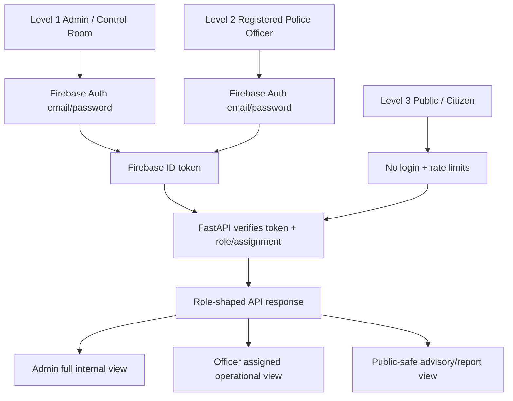
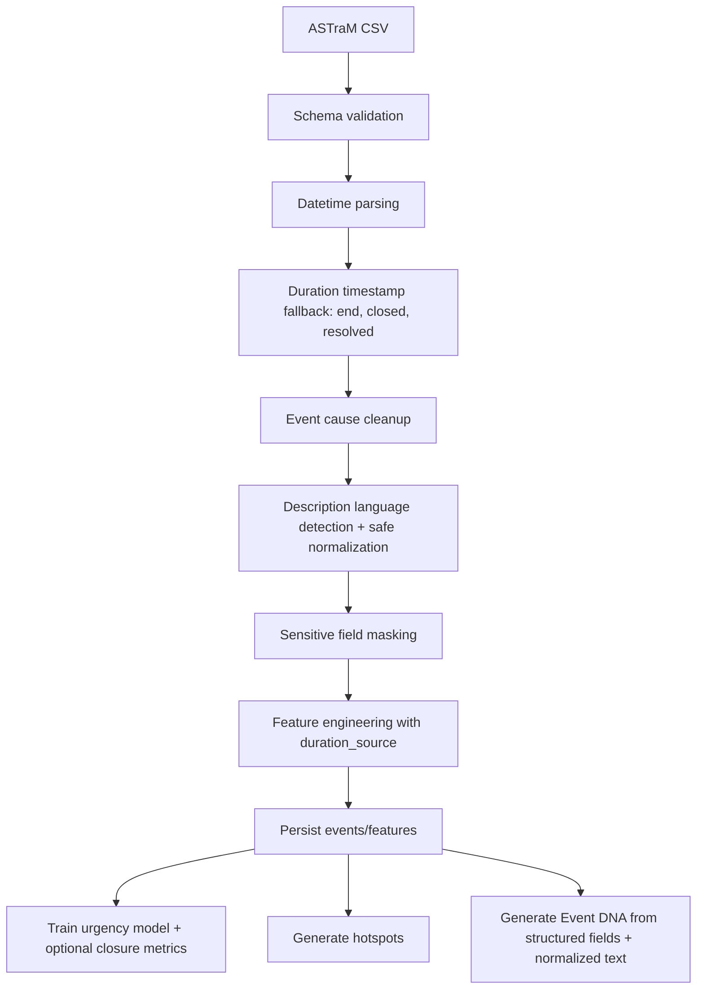
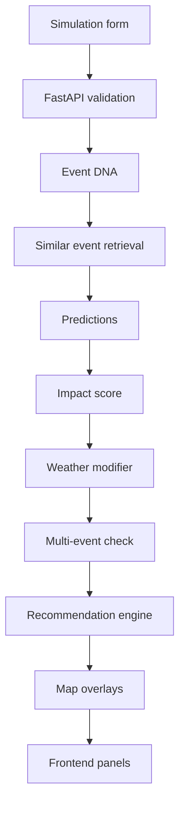
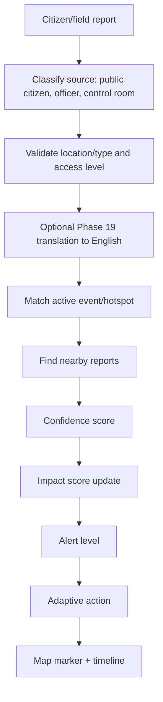
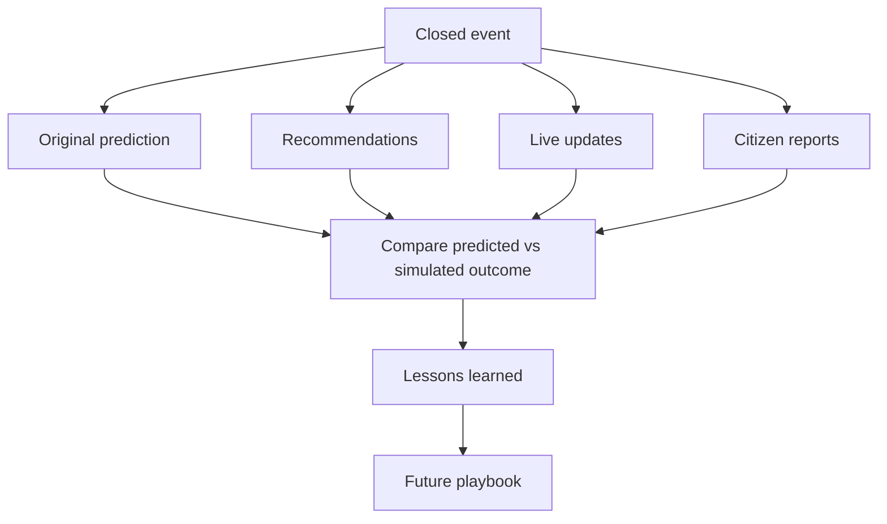

# EventFlow AI Data Flow Documentation

## 0. Access Control Flow

```mermaid
flowchart TD
    A["Level 1 Admin / Control Room"] --> B["Firebase Auth email/password"]
    C["Level 2 Registered Police Officer"] --> D["Firebase Auth email/password"]
    E["Level 3 Public / Citizen"] --> F["No login + rate limits"]
    B --> T["Firebase ID token"]
    D --> T
    T --> G["FastAPI verifies token + role/assignment"]
    F --> G
    G --> H["Role-shaped API response"]
    H --> I["Admin full internal view"]
    H --> J["Officer assigned operational view"]
    H --> K["Public-safe advisory/report view"]
```

## 1. Historical Data Flow

```mermaid
flowchart TD
    A["ASTraM CSV"] --> B["Schema validation"]
    B --> C["Datetime parsing"]
    C --> C2["Duration timestamp fallback: end, closed, resolved"]
    C2 --> D["Event cause cleanup"]
    D --> D2["Description language detection + safe normalization"]
    D2 --> E["Sensitive field masking"]
    E --> F["Feature engineering with duration_source"]
    F --> G["Persist events/features"]
    G --> H["Train urgency model + optional closure metrics"]
    G --> I["Generate hotspots"]
    G --> J["Generate Event DNA from structured fields + normalized text"]
```

## 2. Simulation Data Flow

```mermaid
flowchart TD
    A["Simulation form"] --> B["FastAPI validation"]
    B --> C["Event DNA"]
    C --> D["Similar event retrieval"]
    D --> E["Predictions"]
    E --> F["Impact score"]
    F --> G["Weather modifier"]
    G --> H["Multi-event check"]
    H --> I["Recommendation engine"]
    I --> J["Map overlays"]
    J --> K["Frontend panels"]
```

## 3. Citizen Report Flow

```mermaid
flowchart TD
    A["Citizen/field report"] --> Z["Classify source: public citizen, officer, control room"]
    Z --> B["Validate location/type and access level"]
    B --> T["Optional Phase 19 translation to English"]
    T --> C["Match active event/hotspot"]
    C --> D["Find nearby reports"]
    D --> E["Confidence score"]
    E --> F["Impact score update"]
    F --> G["Alert level"]
    G --> H["Adaptive action"]
    H --> I["Map marker + timeline"]
```

## 4. Post-Event Learning Flow

```mermaid
flowchart TD
    A["Closed event"] --> B["Original prediction"]
    A --> C["Recommendations"]
    A --> D["Live updates"]
    A --> E["Citizen reports"]
    B --> F["Compare predicted vs simulated outcome"]
    C --> F
    D --> F
    E --> F
    F --> G["Lessons learned"]
    G --> H["Future playbook"]
```
