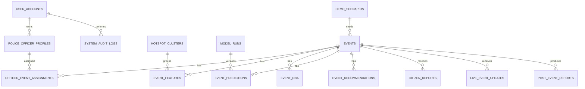

# EventFlow AI Database Design Specification

## 1. Database Choice

Use Supabase PostgreSQL free tier as hosted PostgreSQL only.

Do not use in MVP:

- Supabase Realtime
- Supabase Storage
- Supabase Edge Functions
- Direct frontend-to-Supabase access

Use Firebase Auth for Level 1 and Level 2 identity. Supabase is used only as PostgreSQL storage.

## 2. ER Diagram



## 3. Table Specifications

### user_accounts

Stores EventFlow role-level identities linked to Firebase Auth users.

| Column | Type | Constraints |
|---|---|---|
| id | uuid | primary key |
| role | text | indexed; admin, control_room, police_officer, public_viewer |
| display_name | text | nullable |
| auth_provider | text | firebase |
| auth_provider_uid | text | Firebase UID, unique indexed |
| is_active | boolean | default true |
| created_at | timestamp | default now() |
| updated_at | timestamp | default now() |

MVP notes:

- Level 1 admin/control-room identity uses Firebase UID plus `user_accounts.role`.
- Level 2 officer identity uses Firebase UID plus active `police_officer_profiles`.
- Level 3 public does not require persistent user identity in MVP.

### police_officer_profiles

Stores registered police officer details created by Level 1 admin/control-room.

| Column | Type | Constraints |
|---|---|---|
| id | uuid | primary key |
| user_account_id | uuid | FK user_accounts(id), nullable for demo bootstrap |
| officer_id | text | unique, indexed |
| display_name | text | |
| rank | text | nullable |
| police_station | text | indexed |
| assigned_corridors_json | jsonb | |
| assigned_zones_json | jsonb | |
| firebase_email | text | nullable |
| active | boolean | default true |
| created_at | timestamp | default now() |
| updated_at | timestamp | default now() |

Security notes:

- Store Firebase UID/email reference only; Firebase stores the password.
- Do not expose officer personal identifiers to public APIs.

### officer_event_assignments

Maps registered officers to events, corridors, or stations.

| Column | Type | Constraints |
|---|---|---|
| id | uuid | primary key |
| officer_profile_id | uuid | FK police_officer_profiles(id), indexed |
| event_id | text | nullable FK events(id), indexed |
| corridor | text | nullable, indexed |
| police_station | text | nullable, indexed |
| assignment_type | text | event, corridor, station, reserve |
| assignment_status | text | active, completed, cancelled |
| assigned_by_user_id | uuid | nullable FK user_accounts(id) |
| created_at | timestamp | default now() |
| updated_at | timestamp | default now() |

### system_audit_logs

Stores security and operational audit events.

| Column | Type | Constraints |
|---|---|---|
| id | uuid | primary key |
| actor_user_id | uuid | nullable FK user_accounts(id) |
| actor_role | text | indexed |
| action | text | indexed |
| resource_type | text | indexed |
| resource_id | text | nullable |
| metadata_json | jsonb | |
| request_id | text | nullable |
| created_at | timestamp | indexed |

Audit events:

- dataset loaded/uploaded
- demo reset
- officer created/updated/deactivated
- officer assignment changed
- field report confirmed/denied
- failed Firebase token validation or forbidden role attempt, without storing token values

### events

Stores cleaned ASTraM records.

| Column | Type | Constraints |
|---|---|---|
| id | text | primary key |
| event_type | text | nullable |
| latitude | double precision | indexed |
| longitude | double precision | indexed |
| endlatitude | double precision | nullable |
| endlongitude | double precision | nullable |
| address | text | nullable |
| end_address | text | nullable |
| event_cause | text | nullable |
| event_cause_clean | text | indexed |
| requires_road_closure | boolean | indexed |
| start_datetime | timestamp | indexed |
| end_datetime | timestamp | nullable |
| status | text | indexed |
| authenticated | boolean | nullable |
| modified_datetime | timestamp | nullable |
| direction | text | nullable |
| description | text | nullable |
| description_language | text | default 'unknown'; examples: en, kn, hi, mixed, unknown |
| description_for_features | text | nullable; normalized safe text used for Event DNA/search |
| description_normalization_method | text | nullable; raw_ascii, static_kannada_glossary, transliteration_library, skipped_low_confidence |
| veh_type | text | nullable |
| veh_no_masked | text | nullable |
| corridor | text | indexed |
| priority | text | indexed |
| cargo_material | text | nullable |
| reason_breakdown | text | nullable |
| reason_breakdown_clean | text | nullable |
| age_of_truck | numeric | nullable |
| created_date | timestamp | nullable |
| route_path | text | nullable |
| police_station | text | indexed |
| resolved_at_address | text | nullable |
| resolved_at_latitude | double precision | nullable |
| resolved_at_longitude | double precision | nullable |
| closed_datetime | timestamp | nullable |
| resolved_datetime | timestamp | nullable |
| zone | text | indexed |
| junction | text | indexed |
| raw_payload | jsonb | masked source payload for extra ASTraM fields not promoted to first-class columns |
| created_at | timestamp | default now() |
| updated_at | timestamp | default now() |

Schema note:

- Keep sensitive or low-value ASTraM source fields that are not needed by MVP contracts inside `raw_payload` instead of promoting them to new top-level columns by default.

Indexes:

```text
idx_events_event_cause_clean
idx_events_priority
idx_events_status
idx_events_requires_road_closure
idx_events_start_datetime
idx_events_corridor
idx_events_police_station
idx_events_zone
idx_events_junction
idx_events_lat_lng
```

Archival strategy: keep hackathon data active; production can archive closed events older than 24 months to cold tables.

Coordinate cleaning rule: ASTraM `endlatitude = 0` or `endlongitude = 0` means "missing endpoint", not a real coordinate. Store those as null to avoid map artifacts at `(0, 0)`.

### event_features

Stores derived features.

| Column | Type | Constraints |
|---|---|---|
| id | uuid | primary key |
| event_id | text | FK events(id), unique indexed |
| event_hour | integer | nullable |
| event_day | integer | nullable |
| event_month | integer | nullable |
| event_weekday | integer | nullable |
| is_weekend | boolean | |
| is_peak_hour | boolean | |
| is_night_event | boolean | |
| event_duration_minutes | numeric | nullable |
| closure_duration_minutes | numeric | nullable |
| resolution_duration_minutes | numeric | nullable |
| duration_source | text | nullable; end_datetime, closed_datetime, resolved_datetime, unavailable |
| has_zone | boolean | |
| has_junction | boolean | |
| has_route_path | boolean | |
| has_vehicle_type | boolean | |
| location_cluster_id | text | indexed |
| historical_corridor_risk | numeric | nullable |
| historical_police_station_risk | numeric | nullable |
| historical_cluster_risk | numeric | nullable |
| historical_cause_closure_rate | numeric | nullable |
| historical_corridor_closure_rate | numeric | nullable |
| historical_police_station_closure_rate | numeric | nullable |
| historical_cluster_closure_rate | numeric | nullable |
| created_at | timestamp | default now() |

### event_dna

Stores operational fingerprints.

| Column | Type | Constraints |
|---|---|---|
| id | uuid | primary key |
| event_id | text | FK events(id), unique indexed |
| dna_summary | text | |
| time_context | text | |
| location_context | text | |
| cause_context | text | |
| weather_context | text | nullable |
| multi_event_context | text | nullable |
| historical_pattern | text | |
| risk_indicators_json | jsonb | |
| similar_event_ids_json | jsonb | |
| created_at | timestamp | default now() |

Operational note:

- Before weather and multi-event phases are implemented, `weather_context` and `multi_event_context` should carry explicit deferred-context text rather than unexplained nulls in internal APIs.

### event_predictions

Stores model outputs and estimated impact.

| Column | Type | Constraints |
|---|---|---|
| id | uuid | primary key |
| event_id | text | FK events(id), unique indexed |
| model_run_id | uuid | nullable FK model_runs(id) |
| predicted_priority | text | |
| priority_confidence | numeric | |
| road_closure_probability | numeric | |
| predicted_road_closure | boolean | indexed |
| estimated_clearance_minutes | numeric | nullable |
| clearance_prediction_method | text | nullable; ml_gradient_boosting, historical_similarity, rule_fallback |
| clearance_confidence | numeric | nullable; 0-1 score based on sample count/model availability |
| clearance_confidence_note | text | nullable |
| historical_clearance_range_min | numeric | nullable; lower bound minutes from similar historical events |
| historical_clearance_range_max | numeric | nullable; upper bound minutes from similar historical events |
| estimated_impact_score | numeric | |
| impact_category | text | indexed |
| impact_radius_km | numeric | |
| vehicle_impact_factor | numeric | nullable |
| vehicle_impact_note | text | nullable |
| baseline_risk_score | numeric | nullable |
| additional_event_delta | numeric | nullable |
| weather_adjustment_json | jsonb | nullable |
| multi_event_conflict_json | jsonb | nullable |
| prediction_explanation_json | jsonb | |
| model_version | text | |
| created_at | timestamp | default now() |

Impact category contract:

- Use the four-level operational taxonomy `Low`, `Medium`, `High`, `Critical`.
- Keep `predicted_priority` separate from `impact_category`; the ASTraM priority label remains dataset-backed `High`/`Low` for the current CSV.
- Treat `road_closure_probability` as the primary signal; `predicted_road_closure` is an operational threshold flag derived from it.

### event_recommendations

Stores action plans.

| Column | Type | Constraints |
|---|---|---|
| id | uuid | primary key |
| event_id | text | FK events(id), indexed |
| recommended_total_officers | integer | |
| deployment_plan_json | jsonb | |
| barricade_plan_json | jsonb | |
| diversion_plan_json | jsonb | |
| emergency_corridor_json | jsonb | nullable |
| logistics_impact_json | jsonb | nullable |
| action_confidence_ledger_json | jsonb | |
| recommended_action_summary | text | |
| created_at | timestamp | default now() |

Operational note:

- MVP write paths treat `event_id` as the single active recommendation key for an event and overwrite/coalesce stale duplicates when a plan is regenerated.
- Historical recommendation versioning is future scope; current consumers should read the latest operational plan only.

### hotspot_clusters

Stores risk clusters.

| Column | Type | Constraints |
|---|---|---|
| id | uuid | primary key |
| location_cluster_id | text | unique |
| centroid_latitude | double precision | indexed |
| centroid_longitude | double precision | indexed |
| cluster_event_count | integer | |
| cluster_high_priority_rate | numeric | |
| cluster_road_closure_rate | numeric | |
| cluster_peak_hour_rate | numeric | |
| cluster_top_event_cause | text | |
| cluster_risk_score | numeric | indexed |
| cluster_profile_json | jsonb | |
| created_at | timestamp | default now() |

### citizen_reports

Stores live human signals.

| Column | Type | Constraints |
|---|---|---|
| id | uuid | primary key |
| report_source | text | indexed |
| report_type | text | indexed |
| latitude | double precision | indexed |
| longitude | double precision | indexed |
| severity | text | indexed |
| description | text | nullable |
| language | text | default 'en' |
| source_language | text | nullable; detected/user-selected source language |
| translated_description | text | nullable; English translation for backend reasoning |
| translation_provider | text | disabled, google |
| translation_status | text | disabled, translated, source_already_target, budget_blocked, failed |
| translation_character_count | integer | nullable |
| event_id | text | nullable FK events(id) |
| matched_event_id | text | nullable |
| location_match_confidence | numeric | nullable |
| report_confidence | numeric | nullable |
| impact_score_change | numeric | nullable |
| new_alert_level | text | nullable |
| recommended_action | text | nullable |
| status | text | default 'accepted' |
| created_at | timestamp | indexed |

Allowed sources: citizen, field_officer, control_room, demo.  
Allowed types: heavy_congestion, accident, vehicle_breakdown, waterlogging, road_blockage, crowd_buildup, procession_movement, vip_movement_disruption, construction_obstruction, emergency_vehicle_blockage, other.

Translation notes:

- Base MVP accepts English/Kannada/Hindi static UI labels and stores unknown-language text as raw description.
- Optional Phase 19 enables Google Translate backend translation for any-language report descriptions.
- Raw `description` must be preserved. `translated_description` is supporting context only.

### live_event_updates

Stores live/simulated escalation.

| Column | Type | Constraints |
|---|---|---|
| id | uuid | primary key |
| event_id | text | FK events(id), indexed |
| update_source | text | |
| current_congestion_level | text | |
| field_update | text | nullable |
| road_closure_active | boolean | default false |
| officer_shortage | boolean | default false |
| crowd_increase | boolean | default false |
| rain_waterlogging | boolean | default false |
| new_nearby_incident | boolean | default false |
| expected_impact_score | numeric | nullable |
| current_impact_score | numeric | nullable |
| impact_deviation | numeric | nullable |
| alert_level | text | indexed |
| adaptive_action | text | nullable |
| created_at | timestamp | indexed |

### post_event_reports

Stores learning reports.

| Column | Type | Constraints |
|---|---|---|
| id | uuid | primary key |
| event_id | text | FK events(id), indexed |
| predicted_impact_score | numeric | nullable |
| simulated_actual_impact_score | numeric | nullable |
| impact_deviation | numeric | nullable |
| final_status | text | nullable |
| event_summary | text | |
| prediction_summary | text | |
| recommendation_summary | text | |
| citizen_report_summary | text | nullable |
| live_escalation_summary | text | nullable |
| lessons_learned | text | |
| future_recommendations | text | |
| report_json | jsonb | |
| created_at | timestamp | indexed |

### model_runs

Tracks model metadata.

| Column | Type | Constraints |
|---|---|---|
| id | uuid | primary key |
| model_name | text | indexed |
| model_version | text | |
| target_variable | text | |
| training_rows | integer | |
| test_rows | integer | |
| metrics_json | jsonb | |
| feature_list_json | jsonb | |
| artifact_path | text | nullable |
| created_at | timestamp | indexed |

### demo_scenarios

Stores repeatable demo scenarios.

| Column | Type | Constraints |
|---|---|---|
| id | uuid | primary key |
| scenario_name | text | |
| scenario_type | text | |
| description | text | |
| input_payload_json | jsonb | |
| expected_output_json | jsonb | |
| created_at | timestamp | default now() |

### map_api_usage_logs

Tracks MapmyIndia/Mappls usage, cache behavior, and budget guardrail decisions.

| Column | Type | Constraints |
|---|---|---|
| id | uuid | primary key |
| provider | text | indexed |
| api_name | text | indexed |
| cache_hit | boolean | default false |
| estimated_cost_inr | numeric | default 0 |
| request_hash | text | indexed, nullable |
| status | text | success, failed, fallback, credit_guard |
| fallback_reason | text | nullable |
| created_at | timestamp | indexed |

## 4. Partitioning Strategy

MVP does not require partitioning. Production can partition `events`, `citizen_reports`, and `live_event_updates` by month on timestamp fields.

## 5. Archival Strategy

MVP keeps all records. Production can archive closed/resolved events older than 24 months and keep model-ready aggregates active.
