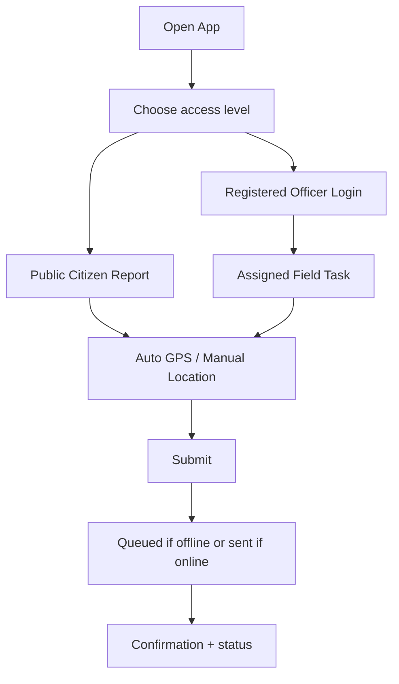

# EventFlow AI Mobile Application Architecture

## 1. MVP Decision

No native mobile app is required for MVP. The public/citizen reporting interface and registered police officer field interface are responsive web/PWA-style pages inside the Next.js app.

Reason:

- Faster hackathon delivery
- Avoids app store/device complexity
- Works on mobile browser
- Keeps free API and deployment constraints simple

## 2. Future Native Mobile Option

If a native mobile app is built later, use **Kotlin only** for Android.

## 3. Future Kotlin Screens

- Login / verified role selection
- Quick Report
- Nearby Events Map
- Assigned Field Task
- Report History
- Offline Queue
- Settings / Language

## 4. Navigation Flow



## 5. State Management

Future Kotlin app should use:

- Jetpack Compose
- ViewModel
- Kotlin Coroutines
- StateFlow
- Room for offline queue

## 6. Offline Support

Offline queue stores:

- report type
- location
- severity
- description
- timestamp
- language

When online, app syncs pending reports to:

```http
POST /api/reports/congestion
```

## 7. Synchronization Strategy

- Retry with exponential backoff.
- Do not duplicate reports; use local UUID idempotency key.
- If server rejects invalid report, mark as failed and show reason.

## 8. Push Notifications

Future only. Free options:

- Firebase Cloud Messaging free tier
- Self-hosted Web Push for PWA

## 9. Performance Optimizations

- Cache static language strings.
- Use low-bandwidth form-first UI.
- Avoid loading heavy map unless user opens map.
- Compress report payload.
