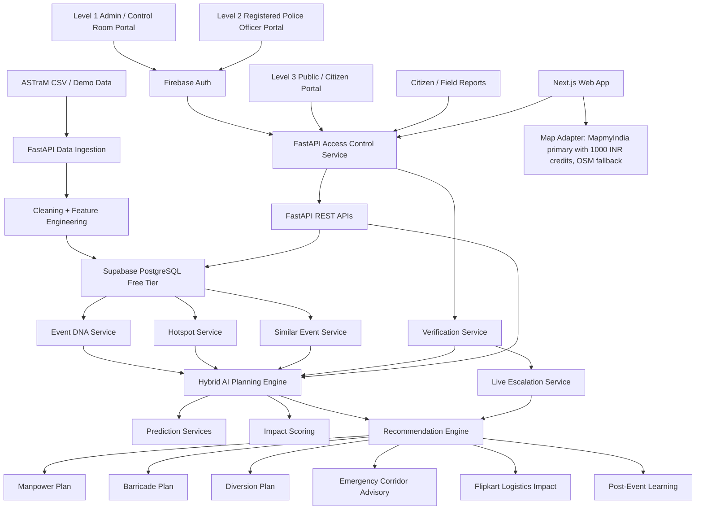
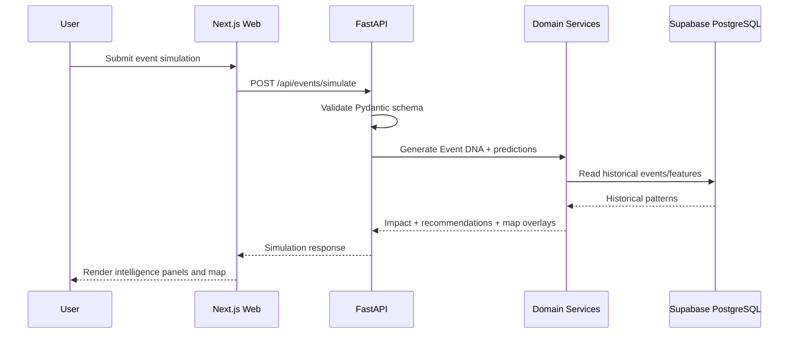
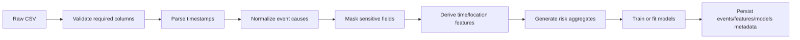
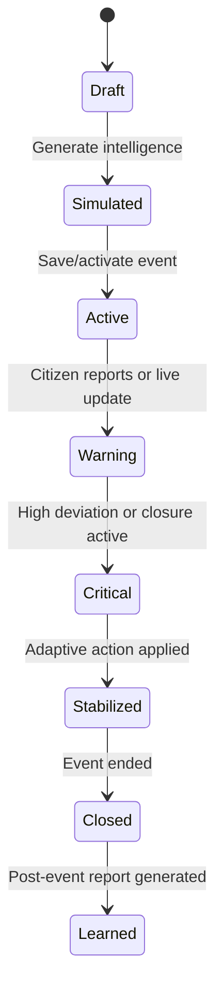
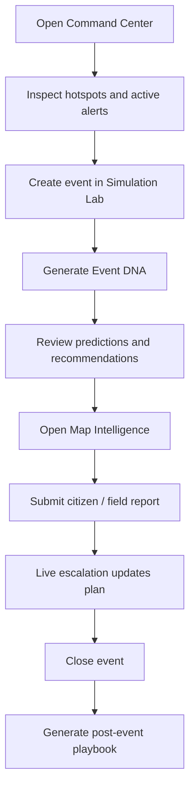
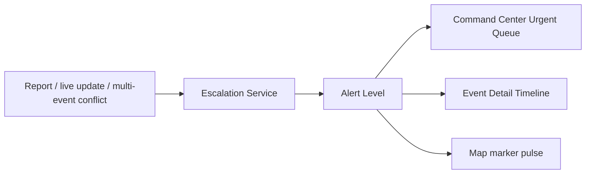
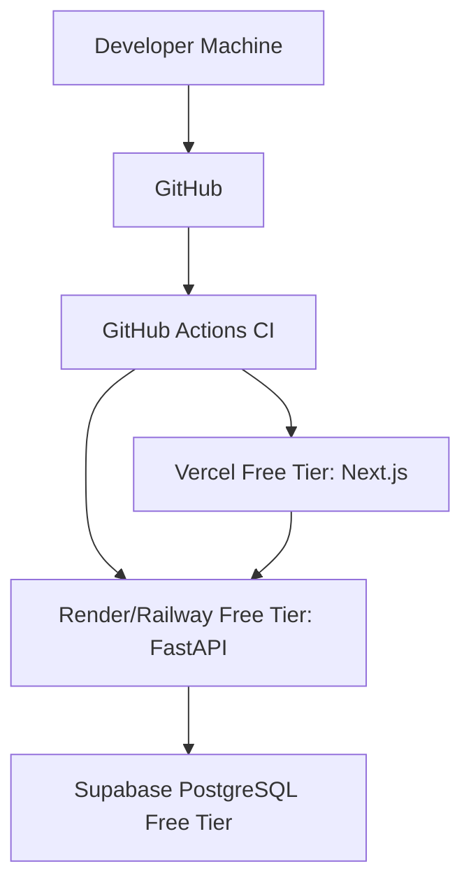
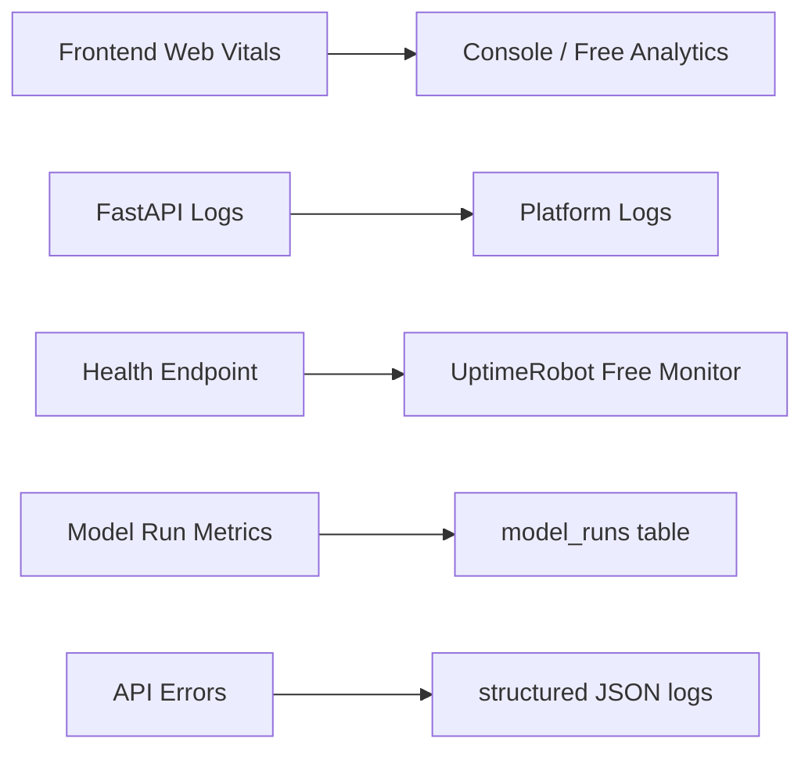
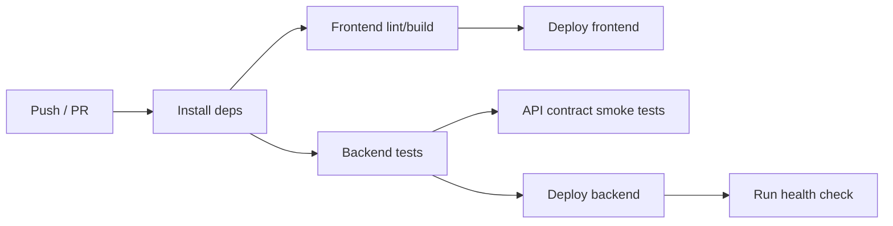

# EventFlow AI System Architecture

## 1. Architecture Goals

EventFlow AI must be modular, explainable, free-tier friendly, and demo-ready. The system must separate map rendering, API orchestration, domain logic, AI/ML inference, database persistence, and report generation.

## 2. High-Level Architecture

## 3. Layer Responsibilities

| Layer | Responsibility |
|---|---|
| Client Layer | Three portals: admin/control room, registered police officer, public/citizen |
| Web Layer | Next.js routing, role-aware dashboards, officer portal, citizen report form, map panels, API hooks |
| Mobile Layer | MVP uses responsive PWA page; native app is future scope |
| API Layer | FastAPI REST endpoints, Firebase ID-token verification, three-level authorization, error handling |
| Service Layer | Event DNA, predictions, recommendations, reports, reports verification |
| Domain Layer | Event, hotspot, report, prediction, recommendation, playbook, officer, assignment concepts |
| Business Logic Layer | Risk scoring, confidence scoring, weather modifiers, multi-event coordination |
| Data Layer | Supabase PostgreSQL, SQLAlchemy repositories, Alembic migrations |
| AI Layer | scikit-learn models, DBSCAN clustering, weighted similarity, rule-based planning |
| Infrastructure Layer | Vercel frontend, Render/Railway backend, Supabase DB, GitHub Actions |

## 4. API Request Flow

## 5. Data Processing Flow

## 6. Event Flow

## 7. User Journey Flow

## 8. Notification Flow

MVP uses in-app alerts only. External SMS, WhatsApp, push notifications, and official police dispatch notifications are future scope.

## 9. Deployment Architecture

## 10. Monitoring Architecture

## 11. CI/CD Pipeline

