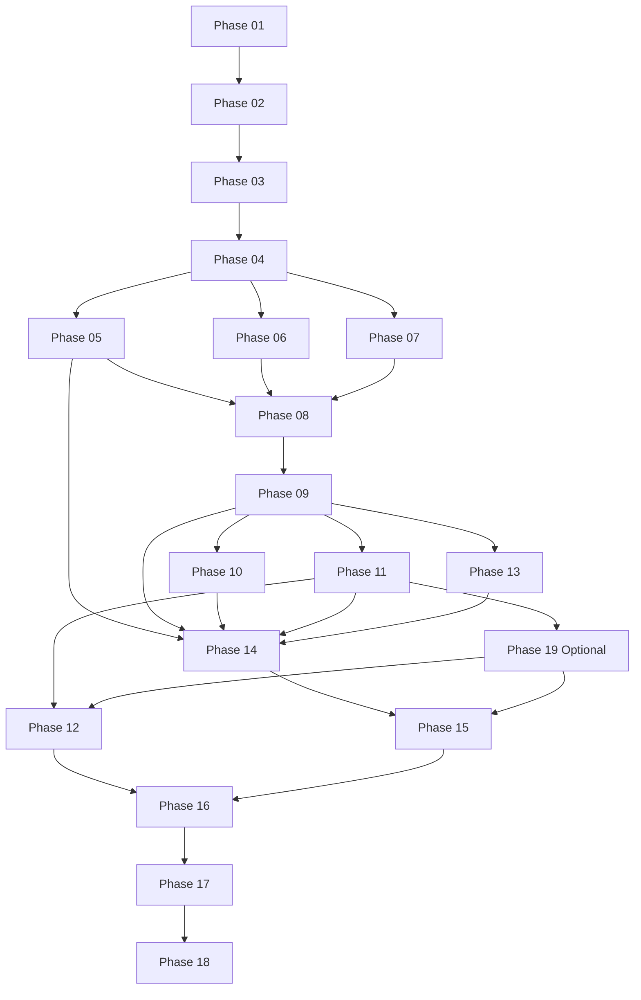

# EventFlow AI Implementation Plan README

## Executive Summary

### Product Vision

EventFlow AI is a predictive traffic command twin for Bengaluru event-driven congestion. It converts ASTraM historical event data, citizen/field reports, weather context, map intelligence, and explainable AI/rule-based planning into police-ready response plans.

### Product Objectives

- Forecast event-related operational impact honestly using available data.
- Support three access levels: admin/control room, registered police officer, and public/citizen.
- Recommend risk-aware manpower, barricading, and simplified diversion plans.
- Support live citizen/field report escalation.
- Support weather-adjusted physical response planning.
- Detect simultaneous multi-event conflicts.
- Preserve emergency corridors as an advisory MVP feature.
- Add Flipkart logistics impact as sponsor-relevant intelligence.
- Generate post-event learning playbooks.
- Optionally translate any-language citizen reports through Google Translate when enabled.

### User Problems

- Traffic response is reactive and experience-driven.
- Event impact is hard to quantify in advance.
- Sudden events may be reported late.
- Multiple events can conflict in corridors, diversions, and manpower.
- There is no strong post-event learning loop.

### Business Goals

- Build a judge-ready Flipkart Gridlock 2.0 Phase 2 prototype.
- Demonstrate feasibility, innovation, real-world impact, and free-tier practicality, with Google Translate as an optional paid/credit-backed enhancement.
- Keep the system extensible for future BTP/ASTraM, MapmyIndia, and Flipkart logistics integrations.

### Success Metrics

- Dashboard loads under 5 seconds.
- Simulation API responds under 3 seconds.
- Event-plan generation responds under 5 seconds.
- Map layer toggles under 2 seconds.
- Demo data loads successfully.
- All recommendations include reason codes.
- No paid APIs are required for the base MVP; optional Phase 19 uses Google Translate only when explicitly enabled.
- No sensitive ASTraM identifiers are exposed.

### Non-Goals

- No exact traffic speed prediction.
- No guaranteed optimal manpower claim.
- No mandatory paid API dependency; Google Translate is optional in Phase 19.
- No native mobile app in MVP.
- No live verified ambulance authentication in MVP.
- No real police dispatch integration in MVP.
- No full city-scale routing engine in MVP.

## System Architecture

### Frontend Architecture

Next.js 14+, TypeScript, Tailwind CSS, TanStack Query, Zustand, command-center UI, responsive citizen report page, MapmyIndia/Mappls primary adapter with OSM/MapLibre fallback.

### Backend Architecture

FastAPI, Pydantic v2, SQLAlchemy, Alembic, modular services for data cleaning, features, ML, Event DNA, hotspots, recommendations, reports, weather, multi-event coordination, and post-event learning.

### Database Architecture

Supabase PostgreSQL free tier used only as hosted PostgreSQL. Frontend never accesses Supabase directly. Tables include user_accounts, police_officer_profiles, officer_event_assignments, system_audit_logs, events, event_features, event_dna, event_predictions, event_recommendations, hotspot_clusters, citizen_reports, live_event_updates, post_event_reports, model_runs, demo_scenarios, and map_api_usage_logs.

### Infrastructure Architecture

Vercel free tier frontend, Render/Railway free tier backend, Supabase PostgreSQL free tier, optional UptimeRobot free health monitoring, local fallback for demo.

### Security Architecture

Backend-only database credentials, Firebase Auth for Level 1 and Level 2 login, backend role/assignment enforcement, sensitive-field masking, Pydantic validation, SQLAlchemy parameterization, CORS restriction, rate-limited public access for Level 3, and no personal citizen identity collection in MVP.

### AI/ML Architecture

Hybrid planning engine: scikit-learn urgency classifier, road closure likelihood scorer, resolution-time/clearance estimator, DBSCAN hotspots, weighted similar-event retrieval, vehicle-type impact weighting, rule-based impact/recommendation engines, weather modifier, multi-event conflict scoring.

### Observability Architecture

/api/health, structured logs, model_runs table, demo readiness page, free uptime monitoring.

### CI/CD Architecture

GitHub Actions for test/build, Vercel frontend deploy, Render/Railway backend deploy, Alembic migrations, health check.

## Dependency Graph

## Build Order

- [Phase_01.md](Phase_01.md) - Repository Scaffold And Environment
- [Phase_02.md](Phase_02.md) - Database Schema ORM And Migrations
- [Phase_03.md](Phase_03.md) - ASTraM Data Cleaning And Ingestion
- [Phase_04.md](Phase_04.md) - Feature Engineering Layer
- [Phase_05.md](Phase_05.md) - Hotspot Detection Engine
- [Phase_06.md](Phase_06.md) - Event DNA And Similar Event Memory
- [Phase_07.md](Phase_07.md) - AI ML Prediction Models
- [Phase_08.md](Phase_08.md) - Estimated Impact Score And Counterfactual Engine
- [Phase_09.md](Phase_09.md) - Recommendation Engine
- [Phase_10.md](Phase_10.md) - Weather Traffic Correlation Engine
- [Phase_11.md](Phase_11.md) - Citizen And Field Report Verification
- [Phase_12.md](Phase_12.md) - Live Escalation Simulator
- [Phase_13.md](Phase_13.md) - Multi Event Coordination Engine
- [Phase_14.md](Phase_14.md) - Map Intelligence UI And Provider Adapter
- [Phase_15.md](Phase_15.md) - Command Center Explorer Simulation Reports Event Detail Model Insights
- [Phase_16.md](Phase_16.md) - Post Event Learning Dashboard
- [Phase_17.md](Phase_17.md) - Demo Mode And Scenario Seeding
- [Phase_18.md](Phase_18.md) - Deployment Monitoring Final QA And Submission Readiness
- [Phase_19.md](Phase_19.md) - Google Translate Multilingual Report Intelligence

## Critical Path Analysis

- **Blocker phases:** 01, 02, 03, 04, 08, 09, 14, 15, 16, 17, 18.
- **High-risk phases:** 07 ML imbalance, 09 recommendation trust, 14 map provider fallback, 17 deterministic demo, 18 free-tier cold starts.
- **Longest dependency chain:** 01 -> 02 -> 03 -> 04 -> 05/06/07 -> 08 -> 09 -> 14 -> 15 -> 16 -> 17 -> 18.
- **Parallelizable phases:** 05, 06, and 07 after Phase 04; 10 and 13 after Phase 09; UI component work can begin after API contracts are stable.
- **Merge points:** Phase 08 combines hotspots/DNA/ML; Phase 14 combines maps/reports/recommendations/conflicts; Phase 17 combines all demo flows.

## Risk Assessment

| Subsystem | Risk | Severity | Probability | Mitigation | Alternative Approach |
|---|---|---:|---:|---|---|
| Dataset | Null/sparse fields | High | Medium | Defensive cleaning and fallback features | Demo seed fixtures |
| ML | Closure imbalance | High | High | Class weights and PR-AUC/recall reporting | Rule fallback |
| Maps | MapmyIndia credit/key/API issue | High | Medium | Provider adapter, 1000 INR credit budget, route caching, budget guardrails | OSM/MapLibre fallback |
| Weather | API unavailable | Medium | Medium | Manual selector | Static demo weather |
| Diversion | No road network | High | High | Simplified NetworkX graph | Predefined route overlays |
| Reports | Fake/spam reports | Medium | Medium | Confidence scoring and rate limits | Field-officer-only mode |
| Deployment | Free-tier cold starts | Medium | High | Warm-up and local fallback | Recorded backup demo |
| Security | Secret leakage | High | Low | Backend-only DB credentials | Local-only demo |

## Phase Summary Table

| Phase | Purpose | Depends On | Unblocks |
| ----- | ------- | ---------- | -------- |
| 1 | Create the monorepo, FastAPI backend, Next.js frontend, base config, and health endpoint. | None | All later phases |
| 2 | Connect FastAPI to Supabase PostgreSQL and create all core tables, including access-control and officer-assignment tables. | Phase 01 | Data ingestion, features, ML, reports, officer portal |
| 3 | Load, validate, clean, mask, and persist ASTraM event records. | Phase 02 | Feature engineering and analytics |
| 4 | Create derived time, duration, availability, and historical risk features. | Phase 03 | Hotspots, Event DNA, ML, scoring |
| 5 | Cluster event locations and produce risk hotspot profiles. | Phase 04 | Map heatmap, Event DNA, impact scoring |
| 6 | Generate operational fingerprints and similar historical event evidence. | Phase 04, Phase 05 | Impact scoring, recommendations, event detail UI |
| 7 | Train and serve urgency, road-closure likelihood, and estimated clearance-time models/fallbacks. | Phase 04 | Impact score and recommendations |
| 8 | Create estimated impact score, category, radius, vehicle-type impact weighting, and baseline-vs-event delta. | Phase 05, Phase 06, Phase 07 | Recommendation engine |
| 9 | Generate manpower, barricade, diversion, emergency corridor, logistics impact, and confidence ledger. | Phase 08 | Weather, reports, map intelligence, post-event learning |
| 10 | Adjust impact, barricading, and diversion for rain, waterlogging, and low visibility. | Phase 09 | Weather-aware demo and post-event learning |
| 11 | Allow reports while scoring confidence and preventing blind trust. | Phase 05, Phase 08, Phase 09 | Live escalation and report map markers |
| 12 | Convert live updates into alert levels and adaptive actions. | Phase 11 | Post-event learning |
| 13 | Detect simultaneous event conflicts across time, space, diversions, and manpower. | Phase 08, Phase 09 | Map conflict overlays and coordinated demo |
| 14 | Render MapmyIndia/Mappls as primary provider using 1000 INR credits, with OSM fallback and operational overlays. | Phase 05, Phase 09, Phase 10, Phase 11, Phase 13 | Core visual demo |
| 15 | Build primary web experience and connect all APIs to UI. | Phase 14 | Post-event dashboard and demo |
| 16 | Generate after-action learning reports and future playbooks. | Phase 12, Phase 15 | Demo closing and learning loop |
| 17 | Make judge demo deterministic and complete. | Phase 16 | Final deployment and rehearsal |
| 18 | Deploy on free tiers, monitor health, and verify full demo. | Phase 17 | Submission |
| 19 | Optionally translate any-language citizen reports using Google Translate with backend-only credentials and budget guardrails. | Phase 11 | Stronger multilingual report intelligence |

## Execution Sequence

Implement phases strictly in numeric order unless a technical lead explicitly approves parallel work. Each Phase_XX.md file is independently understandable and contains the exact purpose, contracts, paths, validation commands, and completion criteria for that phase.

Each phase now also includes an `Implementation Code Snippets` section with phase-specific SQL, Python, TypeScript, YAML, or Docker snippets so another AI/developer can move from planning into implementation without guessing the intended technical shape.

## File Index

- [Phase_01.md](Phase_01.md) - Repository Scaffold And Environment
- [Phase_02.md](Phase_02.md) - Database Schema ORM And Migrations
- [Phase_03.md](Phase_03.md) - ASTraM Data Cleaning And Ingestion
- [Phase_04.md](Phase_04.md) - Feature Engineering Layer
- [Phase_05.md](Phase_05.md) - Hotspot Detection Engine
- [Phase_06.md](Phase_06.md) - Event DNA And Similar Event Memory
- [Phase_07.md](Phase_07.md) - AI ML Prediction Models
- [Phase_08.md](Phase_08.md) - Estimated Impact Score And Counterfactual Engine
- [Phase_09.md](Phase_09.md) - Recommendation Engine
- [Phase_10.md](Phase_10.md) - Weather Traffic Correlation Engine
- [Phase_11.md](Phase_11.md) - Citizen And Field Report Verification
- [Phase_12.md](Phase_12.md) - Live Escalation Simulator
- [Phase_13.md](Phase_13.md) - Multi Event Coordination Engine
- [Phase_14.md](Phase_14.md) - Map Intelligence UI And Provider Adapter
- [Phase_15.md](Phase_15.md) - Command Center Explorer Simulation Reports Event Detail Model Insights
- [Phase_16.md](Phase_16.md) - Post Event Learning Dashboard
- [Phase_17.md](Phase_17.md) - Demo Mode And Scenario Seeding
- [Phase_18.md](Phase_18.md) - Deployment Monitoring Final QA And Submission Readiness
- [Phase_19.md](Phase_19.md) - Google Translate Multilingual Report Intelligence
